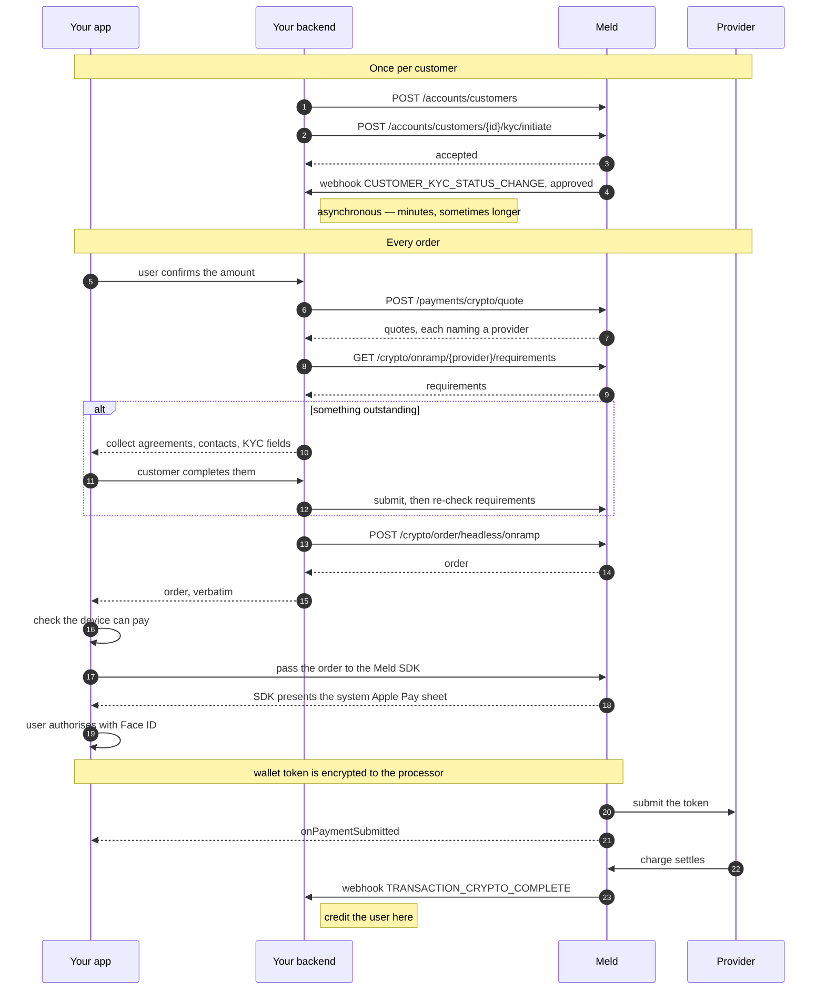

Your backend mints the order, the [Meld SDK](/docs/stablecoins/headless-integration/sdks) presents the sheet, and settlement arrives by webhook.

## Before you begin

1. [Create a customer](/docs/stablecoins/unified-kyc/meld-kyces-the-user#step-1-create-a-meld-customer) and complete [Unified KYC](/docs/stablecoins/unified-kyc). Required — almost every provider refuses an order for a customer Meld has not cleared
2. [Configure webhooks](/docs/stablecoins/headless-integration/shared-flows/configure-webhooks), before KYC so you receive status changes while it runs

---

## Apple Developer setup

Whether you need any depends on how the provider presents the sheet.

| How the sheet is presented | Providers today | Setup |
| --- | --- | --- |
| Natively, by your app | Mercuryo, Banxa | Merchant identifier, payment processing certificate, Apple Pay entitlement |
| Natively, by the provider's own SDK | Stripe | None of your own — the vendor presents under its merchant identifier |
| By the provider, as merchant of record on a page it hosts | Coinbase | None |

You never branch on this in code — the SDK presents whichever surface the order carries. It only decides what you register with Apple up front, so do it once, before your first order with the provider concerned.

**You will need:**

- An Apple Developer account with admin rights on your team
- The payment processing CSR, which your Meld representative provides
- Xcode, to add the capability and regenerate provisioning profiles

<Steps>
  <Step title="Create a merchant identifier">
    A merchant identifier names your app to Apple Pay. It lives under your Apple Developer account, not Meld's.

    1. Go to [Certificates, Identifiers & Profiles](https://developer.apple.com/account/resources/identifiers/list)
    2. Click **Identifiers** in the sidebar, then **+**
    3. Select **Merchant IDs**, then **Continue**
    4. Enter a description and an identifier — it must start with `merchant.` (e.g. `merchant.com.yourcompany.yourapp`)
    5. Click **Continue**, review, then **Register**

    If your app already has a merchant identifier, reuse it. You do not need a new one.
  </Step>
  <Step title="Create a payment processing certificate">
    This certificate is what the Apple Pay token is encrypted to. It must be created from a CSR **Meld provides** — never generate your own for this step, because the processor holds the matching private key.

    Once you have the `.certSigningRequest` file from your Meld representative:

    1. Go to [Certificates, Identifiers & Profiles](https://developer.apple.com/account/resources/identifiers/list)
    2. Click **Identifiers**, filter by **Merchant IDs**, and select the one from Step 1
    3. Under **Apple Pay Payment Processing Certificate**, click **Create Certificate**
    4. Upload the `.certSigningRequest` file Meld provided
    5. Click **Continue**, then **Download** to save the `.cer` file
    6. Send the `.cer` file back to your Meld representative

    Meld passes it to the processor. Wait for confirmation before going further — payments fail until the processor holds it.
  </Step>
  <Step title="Configure Xcode">
    1. Open your project in Xcode and select your app target
    2. Go to the **Signing & Capabilities** tab
    3. Click **+ Capability** and select **Apple Pay**
    4. Under the Apple Pay capability, click **+** and add the merchant identifier from Step 1
    5. Regenerate provisioning profiles

    On React Native, the [Expo config plugin](/docs/stablecoins/headless-integration/sdks/react-native) does this for you — pass the same merchant identifier.
  </Step>
</Steps>

<Note>
  **Certificate expiry.** Apple payment processing certificates expire every 25 months. When yours approaches expiry, repeat Step 2 — Meld will provide a fresh CSR. An expired certificate fails every payment.
</Note>

### Supporting more than one provider

Each processor issues its own certificate, and Apple caps certificates per merchant ID. If you offer Apple Pay through two providers, expect to run the setup twice and check whether you need a second merchant identifier.

### Registering your domain — web only

On the web there is no native sheet: the button renders on **your** origin, so that origin has to be registered with the provider before Apple will let it present one.

Registration is not self-serve. **Contact your Meld representative with the domains you need registered** — Meld brokers each one with the provider, so allow for a round trip per domain, and do it before you plan to go live. Every domain you serve the button from needs its own registration, staging included.

Native-only integrations skip this entirely.

---

## Flow overview

<Frame caption="An Apple Pay purchase, with the system sheet presented over the app">
  <video controls playsInline muted preload="metadata" style={{ width: "100%", maxWidth: "416px", margin: "0 auto", display: "block" }}>
    <source src="/images/headless/banxa-apple-pay.mp4" type="video/mp4" />
  </video>
</Frame>

The sheet is presented by the device, and the wallet token is encrypted to a certificate only the processor can read. Your servers handle the order; they never see payment credentials.



---

## 1. Quote, then check eligibility

Every order starts here, not just the first one.

[Get a quote](/docs/stablecoins/headless-integration/shared-flows/quotes) — it prices the order, names the providers that can take it, and carries the `destinationNetworkCode` the order needs. Then [check eligibility](/docs/stablecoins/headless-integration/shared-flows/eligibility) for the provider you picked: agreements to show, a [verified email or phone](/docs/stablecoins/headless-integration/shared-flows/verification) to collect, KYC the provider still wants. Collect whatever is outstanding before you mint the order, or the rejection lands after the customer thinks they are done.

---

## 2. Create the order

**Endpoint:** [`POST /crypto/order/headless/onramp`](/api-reference/crypto/headless/crypto-order-headless-onramp-create)

**Headers:** `Meld-Version: 2026-05-01`, `X-Idempotency-Key: <uuid>`

```json
{
  "customerId": "WmYYgvN8ukpV62N3m4u3ee",
  "externalOrderId": "order-3ba9f1",
  "serviceProvider": "MERCURYO",
  "paymentMethodType": "APPLE_PAY",
  "countryCode": "FR",
  "sourceAmount": "100",
  "sourceCurrencyCode": "EUR",
  "destinationCurrencyCode": "USDC",
  "destinationWalletAddress": "0x51FB80013111111111111112121111111",
  "destinationNetworkCode": "ETH",
  "clientIpAddress": "203.0.113.24"
}
```

### Verification attestation

[Check eligibility](/docs/stablecoins/headless-integration/shared-flows/eligibility) for the provider the quote named. Where it reports outstanding contact verification or legal agreements, the order carries a `verification` block:

```json
{
  "customerId": "WmYYgvN8ukpV62N3m4u3ee",
  "serviceProvider": "COINBASEPAY",
  "paymentMethodType": "APPLE_PAY",
  "verification": {
    "agreementAcceptedAt": "2026-09-16T10:24:11Z"
  }
}
```

`agreementAcceptedAt` is your own timestamp — the instant the customer accepted the terms you rendered. Meld holds no receipt for it, so there is nothing to look up, and your attestation is what reaches the provider. Keep your own record of which customer accepted which document, and when.

It is validated before the order is built: unparseable, in the future, or older than 60 days is a `400` naming the reason. Any common ISO-8601 spelling is accepted. Capture it per order — a constant or a cached value starts failing once it ages past the window.

The verification ids in the block are optional when the customer verified through Meld, which is the usual case. Supply them only if you ran verification against the provider's own API. See [Email and phone verification](/docs/stablecoins/headless-integration/shared-flows/verification).

<Note>
  Keep `clientIpAddress`: the sheet inputs you pass to the SDK must carry the **same** IP the order was created with.
</Note>

Response:

```json
{
  "id": "WoRdErabcexample0000002",
  "customerId": "WmYYgvN8ukpV62N3m4u3ee",
  "externalOrderId": "order-3ba9f1",
  "paymentMethodType": "APPLE_PAY",
  "paymentMethodResponseDetails": {
    "presentation": "NATIVE_TOKEN",
    "sessionToken": "...",
    "merchantTransactionId": "...",
    "merchantIdentifier": "merchant.com.yourcompany.app"
  },
  "payload": { }
}
```

Return it to your client verbatim. `paymentMethodResponseDetails` carries what the sheet needs — your app does not have to read those fields itself, but it must not drop them.

---

## 3. Present the sheet

Check the device can pay before you offer the button, then hand the order to the [SDK](/docs/stablecoins/headless-integration/sdks).

<CodeGroup>

```tsx React Native
import { Meld, MeldWidget } from '@meldcrypto/react-native-sdk';

if (await Meld.canPresentApplePay()) {
  // show the Apple Pay button
}

<MeldWidget
  order={order}
  applePay={{
    amount: '100.00',            // must match the order
    currencyCode: 'EUR',
    walletAddress: '0x51FB…',
    clientIpAddress: deviceIp,   // the same IP the order was created with
    summaryItemLabel: 'Acme — Buy USDC',
  }}
  onPaymentSubmitted={onPaymentSubmitted}
  onCancel={onCancel}
  onError={onError}
/>
```

```swift iOS
import MeldSDK

guard Meld.canPresentApplePay() else {
    // No card in Wallet, or Apple Pay is restricted. Fall back to card.
    return
}

let handle = try Meld.mount(order, applePay: MeldApplePayRequest(
    amount: 100.00,
    currencyCode: "EUR",                  // must match the order
    walletAddress: "0x51FB…",
    clientIpAddress: deviceIp,            // the same IP the order was created with
    summaryItemLabel: "Acme — Buy USDC"
), handlers: MeldEventHandlers(
    onReady:            { _ in },
    onPaymentSubmitted: { _ in showProcessing() },
    onStatusChange:     { status in track(status) },
    onCancel:           { _ in backToAmount() },
    onError:            { error in showError(error.message) }
))
```

```js Web
import Meld from '@meldcrypto/sdk';

// The provider's component renders its own Apple Pay button and opens the sheet from
// that tap — Apple requires the gesture inside the frame holding the merchant session.
// Do not render a button of your own in front of it.
Meld.mount(order, document.getElementById('checkout'), {
  onReady:            ()  => hideSpinner(),
  onPaymentSubmitted: ()  => showProcessing(),
  onCancel:           ()  => backToAmount(),
  onError:            (e) => showError(e.message),
});
```

</CodeGroup>

On React Native and iOS, pass the Apple Pay inputs for **every** Apple Pay order, whichever provider the quote named — they carry what the sheet shows and the order does not. The SDK presents whichever surface the order carries. On the web there is nothing extra to pass: the order carries it, and the provider's component draws the button.

A native sheet draws nothing into your view, because iOS puts it over your screen. The React Native component still has to stay mounted for as long as the sheet is up, so mount it off-screen when a button triggers it rather than a whole page.

`onCancel` fires when the user dismisses the sheet. Treat it as a change of mind and return them to the amount screen.

<Note>
  Not every provider's Apple Pay works on every platform. Check `Meld.capabilities(order).embeddable` on the web before you offer the button — an order the SDK cannot present there reports `false` rather than failing at mount.
</Note>

---

## 4. Settlement

`onPaymentSubmitted` means the user authorised the sheet. Authorisation is not settlement.

Unmount when it fires and move the user to your own processing screen. Credit them when Meld's [`TRANSACTION_CRYPTO_COMPLETE` webhook](/docs/stablecoins/headless-integration/shared-flows/configure-webhooks) reaches your backend — no SDK event tells you the money moved.

---

## Troubleshooting

| Symptom | Cause |
| --- | --- |
| Sheet does not appear | No card in Wallet, or the entitlement is missing from the build |
| Sheet appears, payment always declines | The processing certificate never got back to the processor, or the wrong key was used |
| `400 INVALID_PAYMENT_METHOD` on order creation | Apple Pay is not available for this country, currency pair or route. Fall back to card |
| `422` `COINBASE_ORDER_REJECTED` | The provider declined the order on its own limits. No order was created and nothing was charged — offer another provider rather than retrying |
| Works in a simulator build but not on device | The iOS simulator cannot produce a usable Apple Pay token. Test on hardware with a sandbox tester account |
