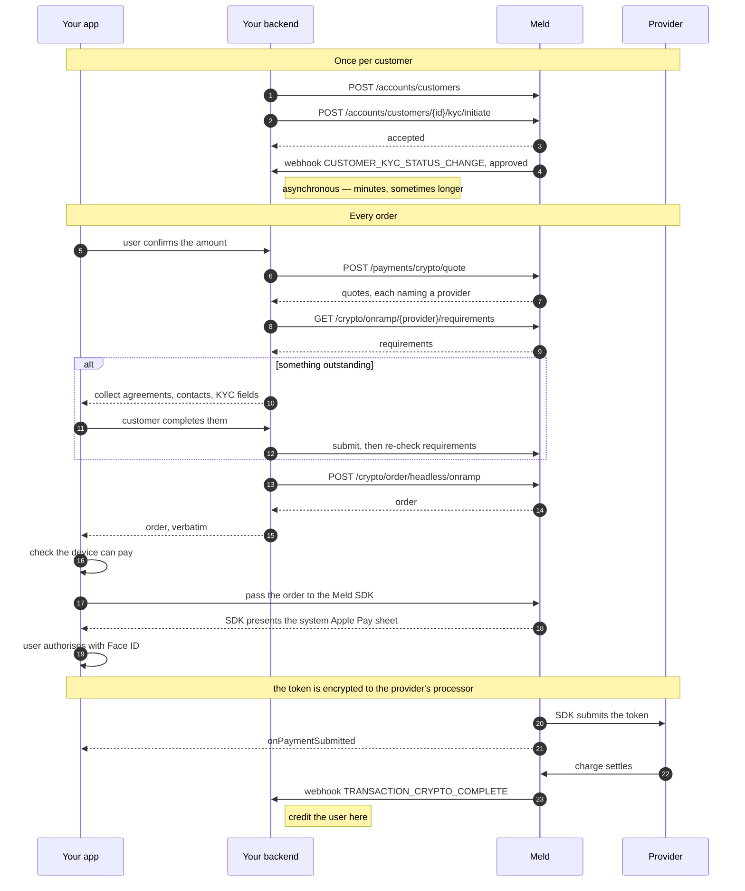

Your backend mints the order, the [Meld SDK](/docs/stablecoins/headless-integration/sdks) presents the sheet, and settlement arrives by webhook.

## Before you begin

1. [Create a customer](/docs/stablecoins/unified-kyc/meld-kyces-the-user#step-1-create-a-meld-customer) and complete [Unified KYC](/docs/stablecoins/unified-kyc). Required — almost every provider refuses an order for a customer Meld has not cleared
2. [Configure webhooks](/docs/stablecoins/headless-integration/shared-flows/configure-webhooks), before KYC so you receive status changes while it runs

Stripe and Coinbase need the customer, but not Unified KYC. What each needs instead is under [Before you begin with Stripe](#before-you-begin-with-stripe) and [Before you begin with Coinbase](#before-you-begin-with-coinbase).

---

## Apple Developer setup

Whether you need any depends on how the provider presents the sheet.

| How the sheet is presented | Providers today | Setup |
| --- | --- | --- |
| Natively, by your app | Mercuryo, Banxa | Merchant identifier, payment processing certificate, Apple Pay entitlement |
| Natively, by the provider's own SDK | Stripe | The same, with the certificate issued from a Stripe CSR. See [Stripe setup](#stripe-setup) |
| By the provider, as merchant of record on a page it hosts | Coinbase | None |

You never branch on this in code — the SDK presents whichever surface the order carries. It only decides what you register with Apple up front, so do it once, before your first order with the provider concerned.

**You will need:**

- An Apple Developer account with admin rights on your team
- The payment processing CSR, which your Meld representative provides. For Stripe, see [Stripe setup](#stripe-setup)
- Xcode, to add the capability and regenerate provisioning profiles

<Steps>
  <Step title="Create a merchant identifier">
    A merchant identifier names your app to Apple Pay. It lives under your Apple Developer account, not Meld's.

    1. Go to [Certificates, Identifiers & Profiles](https://developer.apple.com/account/resources/identifiers/list)
    2. Click **Identifiers** in the sidebar, then **+**
    3. Select **Merchant IDs**, then **Continue**
    4. Enter a description and an identifier — it must start with `merchant.` (e.g. `merchant.com.yourcompany.yourapp`)
    5. Click **Continue**, review, then **Register**

    If your app already has a merchant identifier, reuse it, unless another processor's certificate is on it. See [Supporting more than one provider](#supporting-more-than-one-provider).

    Give your Meld representative the identifier for each environment you use. Meld configures it on your account, and your orders carry it to the SDK. Send it well before your first order in that environment.
  </Step>
  <Step title="Create a payment processing certificate">
    This certificate is what the Apple Pay token is encrypted to. It must be created from a CSR **Meld provides** — never generate your own for this step, because the processor holds the matching private key.

    Once you have the `.certSigningRequest` file from your Meld representative:

    1. Go to [Certificates, Identifiers & Profiles](https://developer.apple.com/account/resources/identifiers/list)
    2. Click **Identifiers**, filter by **Merchant IDs**, and select the one from Step 1
    3. Under **Apple Pay Payment Processing Certificate**, click **Create Certificate**
    4. Upload the `.certSigningRequest` file Meld provided
    5. Click **Continue**, then **Download** to save the `.cer` file
    6. Send the `.cer` file back to your Meld representative

    Meld passes it to the processor. Wait for confirmation before going further — payments fail until the processor holds it.
  </Step>
  <Step title="Configure Xcode">
    1. Open your project in Xcode and select your app target
    2. Go to the **Signing & Capabilities** tab
    3. Click **+ Capability** and select **Apple Pay**
    4. Under the Apple Pay capability, click **+** and add the merchant identifier from Step 1
    5. Regenerate provisioning profiles

    On React Native, the [Expo config plugin](/docs/stablecoins/headless-integration/sdks/react-native) does this for you — pass the same merchant identifier.
  </Step>
</Steps>

<Note>
  **Certificate expiry.** Apple payment processing certificates expire every 25 months. When yours approaches expiry, repeat Step 2 — Meld will provide a fresh CSR. An expired certificate fails every payment.
</Note>

### Supporting more than one provider

Use one merchant identifier per processor. Apple encrypts a merchant identifier's tokens to a single payment processing certificate, so two processors cannot share one. If you offer Apple Pay through two providers, run the setup once for each, with its own identifier.

Your app's Apple Pay entitlement must hold every identifier: add each in Step 3, or list each in the Expo plugin's `merchantIds`. The sheet does not open for an identifier the entitlement lacks.

### Stripe setup

Stripe's SDK presents the sheet under **your** merchant identifier, and Stripe decrypts the token. The certificate therefore comes from a CSR issued by the Stripe account the order runs on:

- **Production:** your Stripe account. In the Stripe Dashboard, open the [iOS certificate settings](https://dashboard.stripe.com/settings/ios_certificates), add an application and download the CSR. Upload it in Step 2, then upload the `.cer` file Apple returns to Stripe, not to Meld. Renew the same way.
- **Sandbox:** Meld's Stripe sandbox. Your Meld representative gives you the CSR, and you send them the `.cer` file Apple returns.

Use a separate merchant identifier for each environment, and give each to your Meld representative as in Step 1. Until Meld has configured it, Stripe Apple Pay orders in that environment fail with `400 PAYMENT_METHOD_NOT_SUPPORTED`. Card orders need no merchant identifier.

### Registering your domain — web only

On the web there is no native sheet: the button renders on **your** origin, so that origin has to be registered with the provider before Apple will let it present one.

Registration is not self-serve. **Contact your Meld representative with the domains you need registered** — Meld brokers each one with the provider, so allow for a round trip per domain, and do it before you plan to go live. Every domain you serve the button from needs its own registration, staging included.

Native-only integrations skip this entirely.

---

## Flow overview

<Frame caption="An Apple Pay purchase, with the system sheet presented over the app">
  <video controls playsInline muted preload="metadata" style={{ width: "100%", maxWidth: "416px", margin: "0 auto", display: "block" }}>
    <source src="/images/headless/banxa-apple-pay.mp4" type="video/mp4" />
  </video>
</Frame>

The sheet is presented on the device, and the wallet token goes to the provider's processor, encrypted. Your servers handle the order; they never see payment credentials.

The diagram shows sheets the Meld SDK presents itself, as for Mercuryo and Banxa. [Stripe](#stripe) and [Coinbase](#coinbase) differ after the order is created.


```mermaid
sequenceDiagram
    autonumber
    participant App as Your app
    participant Api as Your backend
    participant Meld
    participant P as Provider

    Note over App,P: Once per customer
    Api->>Meld: POST /accounts/customers
    Api->>Meld: POST /accounts/customers/{id}/kyc/initiate
    Meld-->>Api: accepted
    Meld->>Api: webhook CUSTOMER_KYC_STATUS_CHANGE, approved
    Note right of Api: asynchronous — minutes, sometimes longer

    Note over App,P: Every order
    App->>Api: user confirms the amount
    Api->>Meld: POST /payments/crypto/quote
    Meld-->>Api: quotes, each naming a provider
    Api->>Meld: GET /crypto/onramp/{provider}/requirements
    Meld-->>Api: requirements
    alt something outstanding
        Api-->>App: collect agreements, contacts, KYC fields
        App->>Api: customer completes them
        Api->>Meld: submit, then re-check requirements
    end

    Api->>Meld: POST /crypto/order/headless/onramp
    Meld-->>Api: order
    Api-->>App: order, verbatim

    App->>App: check the device can pay
    App->>Meld: pass the order to the Meld SDK
    Meld-->>App: SDK presents the system Apple Pay sheet
    App->>App: user authorises with Face ID
    Note over App,P: the token is encrypted to the provider's processor
    Meld->>P: SDK submits the token
    Meld-->>App: onPaymentSubmitted
    P->>Meld: charge settles
    Meld->>Api: webhook TRANSACTION_CRYPTO_COMPLETE
    Note right of Api: credit the user here
```

---

## 1. Quote, then check eligibility

Every order starts here, not just the first one.

[Get a quote](/docs/stablecoins/headless-integration/shared-flows/quotes) — it prices the order, names the providers that can take it, and carries the `destinationNetworkCode` the order needs. Then [check eligibility](/docs/stablecoins/headless-integration/shared-flows/eligibility) for the provider you picked: agreements to show, a [verified email or phone](/docs/stablecoins/headless-integration/shared-flows/verification) to collect, KYC the provider still wants. Collect whatever is outstanding before you mint the order, or the rejection lands after the customer thinks they are done.

---

## 2. Create the order

**Endpoint:** [`POST /crypto/order/headless/onramp`](/api-reference/crypto/headless/crypto-order-headless-onramp-create)

**Headers:** `Meld-Version: 2026-05-01`, `X-Idempotency-Key: <uuid>`

```json
{
  "customerId": "WmYYgvN8ukpV62N3m4u3ee",
  "externalOrderId": "order-3ba9f1",
  "serviceProvider": "MERCURYO",
  "paymentMethodType": "APPLE_PAY",
  "countryCode": "FR",
  "sourceAmount": "100",
  "sourceCurrencyCode": "EUR",
  "destinationCurrencyCode": "USDC",
  "destinationWalletAddress": "0x51FB80013111111111111112121111111",
  "destinationNetworkCode": "ETH",
  "clientIpAddress": "203.0.113.24"
}
```

Send the customer's public IP as `clientIpAddress`. The SDK takes the IP and the destination wallet from the order, so you do not pass them to it again.

Response, for this Mercuryo order. `...` marks values elided here:

```json
{
  "id": "WoRdErabcexample0000002",
  "customerId": "WmYYgvN8ukpV62N3m4u3ee",
  "externalOrderId": "order-3ba9f1",
  "paymentMethodType": "APPLE_PAY",
  "responseKind": "SESSION",
  "paymentMethodResponseDetails": {
    "presentation": "NATIVE_TOKEN",
    "sessionToken": "...",
    "merchantTransactionId": "...",
    "merchantIdentifier": "merchant.com.yourcompany.app"
  },
  "payload": { "...": "echo of your request" },
  "paymentActions": { "...": "read by the SDK" },
  "headlessPresentation": {
    "surface": "NATIVE_TOKEN",
    "protocol": "MELD_WALLET_TOKEN",
    "version": 1
  }
}
```

Return it to your client verbatim. `paymentMethodResponseDetails`, `paymentActions` and `headlessPresentation` carry what the SDK needs. Your app does not have to read those fields itself, but it must not drop them.

Stripe and Coinbase orders have a different shape: see [Create a Stripe order](#create-a-stripe-order) and [Create a Coinbase order](#create-a-coinbase-order).

---

## 3. Present the sheet

Check the device can pay before you offer the button, then hand the order to the [SDK](/docs/stablecoins/headless-integration/sdks).

<CodeGroup>

```tsx React Native
import { Meld, MeldWidget } from '@meldcrypto/react-native-sdk';

if (await Meld.canPresentApplePay()) {
  // show the Apple Pay button
}

<MeldWidget
  order={order}
  applePay={{
    amount: '100.00',            // must match the order
    currencyCode: 'EUR',
    email: customerEmail,        // used only when the sheet returns none
    summaryItemLabel: 'Acme — Buy USDC',
  }}
  onPaymentSubmitted={onPaymentSubmitted}
  onCancel={onCancel}
  onError={onError}
/>
```

```swift iOS
import MeldSDK

guard Meld.canPresentApplePay() else {
    // No card in Wallet, or Apple Pay is restricted. Fall back to card.
    return
}

let handle = try Meld.mount(order, applePay: MeldApplePayRequest(
    amount: 100.00,
    currencyCode: "EUR",                  // must match the order
    email: customerEmail,                 // used only when the sheet returns none
    summaryItemLabel: "Acme — Buy USDC"
), handlers: MeldEventHandlers(
    onReady:            { _ in },
    onPaymentSubmitted: { _ in showProcessing() },
    onStatusChange:     { status in track(status) },
    onCancel:           { _ in backToAmount() },
    onError:            { error in showError(error.message) }
))
```

```js Web
import Meld from '@meldcrypto/sdk';

// The provider's component renders its own Apple Pay button and opens the sheet from
// that tap — Apple requires the gesture inside the frame holding the merchant session.
// Do not render a button of your own in front of it.
Meld.mount(order, document.getElementById('checkout'), {
  onReady:            ()  => hideSpinner(),
  onPaymentSubmitted: ()  => showProcessing(),
  onCancel:           ()  => backToAmount(),
  onError:            (e) => showError(e.message),
});
```

</CodeGroup>

On React Native and iOS, pass the Apple Pay inputs for every Apple Pay order, whichever provider it routed to: they carry what the sheet shows and the order does not. On a Stripe order they must match the order's amount and currency; a Coinbase order ignores them. On the web there is nothing extra to pass: the provider's component draws the button.

A native sheet draws nothing into your view. On React Native, keep the component mounted anyway: see [Mount the order](/docs/stablecoins/headless-integration/sdks/react-native#mount-the-order).

`onCancel` fires when the user dismisses the sheet. Treat it as a change of mind and return them to the amount screen.

<Note>
  Stripe and Coinbase Apple Pay run only in an iOS app. Check [`Meld.capabilities`](/docs/stablecoins/headless-integration/sdks#check-before-you-mount) before you offer the button.
</Note>

---

## 4. Settlement

`onPaymentSubmitted` means the user authorised the sheet. Authorisation is not settlement.

Unmount when it fires and move the user to your own processing screen. Credit them when Meld's [`TRANSACTION_CRYPTO_COMPLETE` webhook](/docs/stablecoins/headless-integration/shared-flows/configure-webhooks) reaches your backend — no SDK event tells you the money moved.

---

## Stripe

Stripe runs the purchase in its own SDK (Link sign-in, identity checks, the Apple Pay sheet and checkout), driven by the Meld SDK. Stripe card orders run the same flow; [Cards](/docs/stablecoins/headless-integration/cards#stripe) covers the one difference.

### Stripe scope

| | Stripe headless |
| --- | --- |
| Customers | US, except New York. Stripe checks the state inside its flow: an unserved customer ends in `PRESENTATION_FAILED` before payment, or as in [When Stripe refuses the payment](#when-stripe-refuses-the-payment) |
| Currency | USD in. The headless quote lists the tokens and networks |
| Payment methods | `APPLE_PAY` and `CREDIT_DEBIT_CARD` |
| Clients | iOS, directly or through the [React Native SDK](/docs/stablecoins/headless-integration/sdks/react-native#stripe-orders). Not the web SDK, not Android |
| KYC | None by Meld. The headless quote reports `kycMode: PROVIDER_MANAGED`, and Stripe verifies the customer inside the flow |
| Credentials | Production: your own Stripe account, onboarded by Stripe for its crypto onramp and set up on Meld. Sandbox: Meld's Stripe sandbox, which Meld enables on your sandbox account. See [Before you begin](#before-you-begin-with-stripe) |
| Environments | Sandbox and production. See [Test Stripe](/docs/stablecoins/sandbox-guide/headless-testing#test-stripe) |

### Before you begin with Stripe

For production, set up your own Stripe account:

- **Stripe onboarding.** Stripe onboards your account for its embedded crypto onramp, which is in private preview. Onboarding enables the onramp and Link, provisions a Link OAuth client ID and client secret, gives you the API version for the onramp, and registers your app with Stripe as a trusted application. No Stripe call succeeds before it is complete. Ask Stripe to enable `source_total_amount` and `preferred_payment_method` on your account.
- **Your Stripe integration on Meld.** Add your Stripe publishable key, secret key and webhook signing secret to your Meld account, as in [provider setup](/docs/stablecoins/for-all-products/service-provider-setup). Set the integration's environment to Production and use live keys.
- **Headless fields.** On the same integration, also enter the Link OAuth client ID and client secret that Stripe provisioned, and the headless API version Stripe gave you: a dated version ending in `;crypto_onramp_beta=v2`. It is not the widget's version on the provider setup page.
- **Stripe webhooks to Meld.** Meld settles Stripe orders only from Stripe's webhooks. In Stripe, add a webhook endpoint at the webhook URL the Meld dashboard shows for your Stripe integration, subscribed to `crypto.onramp_session.updated`, and save its signing secret as the integration's webhook secret.

In sandbox, Meld provides the Stripe integration instead: see [Test Stripe](/docs/stablecoins/sandbox-guide/headless-testing#test-stripe).

In both environments:

- **An email on the customer.** Link sign-in uses it: see [The Link email is the customer's email](#the-link-email-is-the-customers-email). [Eligibility](/docs/stablecoins/headless-integration/shared-flows/eligibility) reports a missing one before you create the order.
- **[Stripe setup](#stripe-setup)**, for Apple Pay.
- Unified KYC is optional. If the customer has passed it, the SDK fills Stripe's KYC from it: see [Prefill](#prefill).

### Create a Stripe order

Send the [step 2](#2-create-the-order) request with `serviceProvider: STRIPE`, `countryCode: US`, `sourceCurrencyCode: USD` and the quote's `destinationNetworkCode`. Both `destinationNetworkCode` and the `X-Idempotency-Key` header are required. `sourceAmount` can have at most two decimal places, or the payment fails.

Creating the order charges nothing. It returns a bootstrap for Stripe's SDK. This sandbox example shows every field the SDK needs; `...` marks values elided here:

```json
{
  "id": "WoRdErabcexample0000003",
  "customerId": "WmYYgvN8ukpV62N3m4u3ee",
  "externalOrderId": "order-5c71d2",
  "paymentMethodType": "APPLE_PAY",
  "responseKind": "SDK_BOOTSTRAP",
  "paymentMethodResponseDetails": {
    "sdkBootstrapType": "STRIPE_CRYPTO_ONRAMP",
    "providerIntentId": "lai_...",
    "continuationToken": "...",
    "sdkFlow": "AUTHORIZE",
    "sdkEnvironment": "SANDBOX",
    "expiresAtEpochSeconds": 1791300000,
    "clientConfiguration": {
      "publicKey": "pk_test_...",
      "walletNetwork": "ethereum",
      "merchantIdentifier": "merchant.com.yourcompany.app.stripe.sandbox"
    }
  },
  "payload": { "...": "echo of your request" },
  "paymentActions": { "...": "read by the SDK" },
  "headlessPresentation": {
    "surface": "NATIVE_SDK",
    "protocol": "STRIPE_CRYPTO_ONRAMP",
    "version": 1
  }
}
```

| Field | What it is |
| --- | --- |
| `continuationToken` | A short-lived credential for this order. Never log it |
| `expiresAtEpochSeconds` | When the bootstrap stops working. Past it, create a new order |
| `sdkEnvironment` | `SANDBOX` or `PRODUCTION`. Configure the SDK for the same [environment](/docs/stablecoins/headless-integration/sdks#environments), or the order cannot be mounted |
| `clientConfiguration.publicKey` | The Stripe publishable key for the order: `pk_test_` in sandbox, `pk_live_` in production |
| `clientConfiguration.merchantIdentifier` | Apple Pay only. The merchant identifier Meld configured for your account in this environment. See [Stripe setup](#stripe-setup) |

The SDK refuses a Stripe order that lacks any field it needs, so forward the whole response, not selected fields.

The SDK then continues the order from the device, calling Meld with the `continuationToken`. You never make those calls yourself: their outcomes reach you as [SDK callbacks](/docs/stablecoins/headless-integration/sdks/ios#stripe-orders), and settlement works as in [step 4](#4-settlement).

### The Link email is the customer's email

Meld starts Link sign-in with the email on the Meld customer record, and the SDK [prefills](#prefill) that email, so the customer normally doesn't type one. As a result:

- Link sends its code to the phone on the Link account that email belongs to, not to a number your app collected
- If the email has no Link account, the SDK registers one with it

### Prefill

The SDK fills Stripe's screens from the Meld customer, so it asks the customer for as little as it can:

| Field | Sent when | The SDK uses it to |
| --- | --- | --- |
| `email` | The customer's email is a valid address | Sign in to Link |
| `phone` | The phone is verified with Meld and in E.164 form | Register a new Link account without a form |
| `fullName` | The customer has a first and last name | Name that new Link account |
| `identity` | The customer passed [Unified KYC](/docs/stablecoins/unified-kyc): first and last name, date of birth, US residence address | Fill Stripe's first KYC request, so the customer types only what it lacks |

Prefill depends on the email. If the customer's email is not a valid address, Meld sends no prefill at all: the SDK asks for the email on its own **Sign in to Link** form, then asks for everything else.

The SSN is never prefilled. The customer types it into the SDK, which hands it straight to Stripe, so it reaches neither Meld nor your servers. If Stripe rejects a prefilled submission, the SDK shows the full form.

### When Stripe refuses the payment

Stripe can refuse to create the payment session, or fail the session afterwards, for example for an unsupported card. Meld also refuses a session from a device whose IP address is not public, before calling Stripe. In each case nothing was charged and nothing will settle. The SDK reports `onError` `PAYMENT_REJECTED`: offer another payment method or provider, on a new order.

Some refusals report `PAYMENT_OUTCOME_UNKNOWN` instead, most often an amount over the customer's Stripe limit, because the device had already started the payment. Nothing was charged, but handle it like any `PAYMENT_OUTCOME_UNKNOWN`: track the order through your backend and never pay it again.

### Errors on Stripe order creation

Errors use the [standard envelope](/docs/meld-api/error-responses). On a Stripe order, these codes mean:

| HTTP | `code` | Cause | What to do |
| --- | --- | --- | --- |
| `400` | `INVALID_CRYPTO_CURRENCY` | `destinationNetworkCode` is missing | Send the quote's `destinationNetworkCode`, with a new `X-Idempotency-Key` |
| `400` | `PAYMENT_METHOD_NOT_SUPPORTED` | No Stripe headless route for this country, currency pair, network and method. Or your Stripe integration cannot serve the order: its keys do not match its environment (a `pk_live_` key on an integration set to Sandbox, or the reverse), or, for Apple Pay, Meld has no merchant identifier for you in this environment | Re-quote with `integrationMode=HEADLESS` and carry its values into the order. Otherwise check your Stripe integration and, for Apple Pay, [Stripe setup](#stripe-setup) |
| `400` | `HEADLESS_NOT_SUPPORTED` | Meld's own checks refused the order before any call to Stripe: the order does not match a Stripe headless route, or Stripe headless is not available to your account | Re-quote with `integrationMode=HEADLESS` and send its values unchanged. If it persists, ask your Meld representative |
| `400` | `ACCOUNT_BAD_CONFIGURATION` | Your Stripe integration is not set up for headless orders: the Link OAuth client ID or secret, or the headless API version, is missing or malformed | Add the missing value to your Stripe integration in the Meld dashboard. See [headless fields](#before-you-begin-with-stripe) |
| `403` | `VERIFICATION_REQUIRED` | The Meld customer has no email; `errors` names `email: MISSING` | Add one with `PATCH /accounts/customers/{customerId}`, then retry |
| `409` | `HEADLESS_PAYMENT_OUTCOME_UNKNOWN` | Meld could not confirm with Stripe whether sign-in started | Nothing was charged. Create a new order rather than retrying in a loop |
| `422` | `STRIPE_HEADLESS_PROVIDER_REJECTED` | Stripe refused to start Link sign-in, or you retried an order whose bootstrap had already failed or expired. Stripe's reason can be this customer, such as a Link connection they revoked, or your whole Stripe account: onboarding not complete, Link sign-in not enabled, or an invalid secret key | Nothing was charged. Create a new order. If every order fails this way, a new order will not help: check your Stripe onboarding and keys with Stripe |
| `425` | `HEADLESS_PAYMENT_IN_PROGRESS` | The same request is still being processed | Retry shortly with the same `X-Idempotency-Key` |

---

## Coinbase

Coinbase takes the payment on its own checkout page, as merchant of record. The Meld SDK opens Coinbase's Apple Pay sheet from that page, and the customer sees only the sheet.

### Coinbase scope

| | Coinbase headless |
| --- | --- |
| Customers | US only, with a US mobile number |
| Currency | USD in. The headless quote lists the tokens and networks |
| Payment methods | `APPLE_PAY` only |
| Clients | iOS 16 or later, through the [iOS SDK](/docs/stablecoins/headless-integration/sdks/ios#coinbase-orders) or the [React Native SDK](/docs/stablecoins/headless-integration/sdks/react-native#coinbase-orders) on iOS. Not the web SDK, not Android |
| Apple setup | None. No merchant identifier, certificate or domain registration |
| KYC | None up front. The headless quote reports `kycMode: PROVIDER_MANAGED`, and Coinbase asks for identity only to raise a customer's limit: see [Coinbase limits](#coinbase-limits) |
| Credentials | Coinbase set up on your Meld account. Contact your Meld representative |
| Environments | Production. Sandbox covers everything up to order creation: see [Test Coinbase in sandbox](#test-coinbase-in-sandbox) |

### Before you begin with Coinbase

Coinbase takes an order only from a customer with a verified email, a verified US mobile number and a recorded acceptance of its agreements. Meld checks all three before it places the order, so collect them while the customer is still in your flow.

[Eligibility](/docs/stablecoins/headless-integration/shared-flows/eligibility) reports what is outstanding. Pass the customer and the full order intent, and Meld runs the same checks the order will:

```
GET /crypto/onramp/COINBASEPAY/requirements
  ?customerId=WmYYgvN8ukpV62N3m4u3ee
  &paymentMethodType=APPLE_PAY
  &sourceCurrencyCode=USD
  &sourceAmount=50
  &destinationCurrencyCode=USDC
  &destinationNetworkCode=ETH
  &countryCode=US
```

The email and phone fields read as on [Eligibility](/docs/stablecoins/headless-integration/shared-flows/eligibility#contact-verification). These are the parts specific to Coinbase:

```json
{
  "legalAgreements": [
    { "type": "GUEST_CHECKOUT_TERMS_OF_SERVICE", "url": "https://www.coinbase.com/legal/guest-checkout/us", "region": "US", "code": "GUEST_CHECKOUT_TERMS_OF_SERVICE:US" },
    { "type": "TERMS_OF_SERVICE", "url": "https://www.coinbase.com/legal/user_agreement", "code": "TERMS_OF_SERVICE" },
    { "type": "PRIVACY_POLICY", "url": "https://www.coinbase.com/legal/privacy", "code": "PRIVACY_POLICY" }
  ],
  "verificationRequirements": {
    "verifyWith": { "endpoint": "/accounts/customers/{customerId}/verifications", "serviceProvider": "COINBASEPAY" },
    "agreement": { "required": true, "maxAgeDays": 60, "codes": ["GUEST_CHECKOUT_TERMS_OF_SERVICE:US", "TERMS_OF_SERVICE", "PRIVACY_POLICY"] }
  },
  "customerStatus": {
    "agreement": { "satisfied": false, "reason": "MISSING", "unmetCodes": ["GUEST_CHECKOUT_TERMS_OF_SERVICE:US", "TERMS_OF_SERVICE", "PRIVACY_POLICY"] }
  }
}
```

Read the agreement codes from this response rather than hardcoding them.

#### Verify the email and phone

Verify both with [Meld's one-time code](/docs/stablecoins/headless-integration/shared-flows/verification), and send `serviceProvider: "COINBASEPAY"` on each trigger:

```json
{
  "channel": "PHONE",
  "target": "+14155550123",
  "serviceProvider": "COINBASEPAY"
}
```

An email code sent without `serviceProvider` does not count for Coinbase, and the order is refused with `email: MISSING`. A verification counts for 60 days; after that, eligibility reports the channel as `STALE` and the customer verifies again.

#### Record the agreements

Show each document in `legalAgreements` in your own UI, and gate your flow on the customer accepting. Then record the acceptance in one of two ways:

1. **One receipt per code.** Call `POST /accounts/terms-of-service/acceptances` once for each code in `agreement.codes`:

   ```json
   {
     "externalCustomerId": "your-internal-user-id-123",
     "serviceProvider": "COINBASEPAY",
     "code": "GUEST_CHECKOUT_TERMS_OF_SERVICE:US",
     "acceptedAt": "2026-10-07T10:24:11Z",
     "ipAddress": "203.0.113.24"
   }
   ```

   `ipAddress` is the IP the customer accepted from, and it is required. Send the `externalCustomerId` of the Meld customer you will order for: Meld creates a new customer for a value it has not seen, and the receipt lands there. A customer without an `externalCustomerId` cannot hold receipts, and eligibility reports its agreement as `UNRECORDABLE`, so use the second way for that customer.

2. **An acceptance time on the order.** Send `verification.agreementAcceptedAt` on the create request: the instant, in ISO-8601, at which the customer accepted the documents you showed. Keep your own record of which customer accepted which document, and when.

Meld reads receipts first, and uses `agreementAcceptedAt` when receipts do not cover every code. Either way, an acceptance counts for `maxAgeDays`, 60 days. Send the instant the customer actually accepted, not the time of the order. Once an acceptance is more than 60 days old, show the documents again and record the new acceptance.

#### Coinbase limits

The per-order minimum and maximum are on the [routes API](/docs/stablecoins/white-label-api-integration/whitelabel-api-guide#supported-routes), in `paymentMethods[].limits`.

Coinbase also limits each customer: a weekly spending cap, and a lifetime cap on the number of transactions. Coinbase applies the weekly cap itself, and refuses an order over it with `422 HEADLESS_PROVIDER_REJECTED`. Meld checks the lifetime cap before it places the order: when the customer has reached it, eligibility reports a `PROVIDER_EXTRA_KYC` requirement with the `limitUpgrade` process, and the order is refused with `422 CUSTOMER_NOT_PAYMENT_READY`:

| `errors` | What to do |
| --- | --- |
| `limitUpgrade: REQUIRED` | Run the `limitUpgrade` process, then resend the same request |
| `limitUpgrade: PENDING` | Coinbase is reviewing the customer's upgrade. Wait, then re-check eligibility |
| `limitUpgrade: BLOCKED` | Coinbase will not raise the limit. Offer another provider |

To run the process, call `POST /crypto/onramp/COINBASEPAY/processes/limitUpgrade` from your backend, with the customer and the same order intent:

```json
{
  "customerId": "WmYYgvN8ukpV62N3m4u3ee",
  "order": {
    "paymentMethodType": "APPLE_PAY",
    "sourceCurrencyCode": "USD",
    "sourceAmount": 50,
    "destinationCurrencyCode": "USDC",
    "destinationNetworkCode": "ETH",
    "countryCode": "US"
  },
  "operation": "READ"
}
```

`READ` returns the process `status`, the customer's current `limits`, and the `inputSources` Coinbase offers. Send `operation: START` with one of them as `inputSource`:

- `HOSTED_FORM` returns `hostedForm.url`, a Coinbase page for the customer to complete before `hostedForm.expiresAt`. Never log or store it.
- `CUSTOMER_KYC` sends Coinbase the date of birth and SSN last four from the customer's [Unified KYC](/docs/stablecoins/unified-kyc). Without both, it is refused with `403 KYC_NOT_COMPLETED`.

Then `READ` every `process.pollIntervalMs` while `pollable` is `true`, and resend the order once `status` is `SATISFIED`:

- `PENDING` after `process.pollTimeoutMs` means Coinbase is still reviewing the customer. Stop, and re-check eligibility later.
- `REQUIRED` with `reason: CORRECT_IDENTITY` means the customer must correct their details. Only `HOSTED_FORM` is offered.
- `BLOCKED` and `UNAVAILABLE` mean Coinbase will not raise the limit. Offer another provider.
- `UNKNOWN` means Meld could not read the state from Coinbase. Try again later.

Never retry `START` automatically.

### Create a Coinbase order

Send `walletAddress` on the [headless quote](/docs/stablecoins/headless-integration/shared-flows/quotes), so that Coinbase prices the same checkout the order uses. Then send the [step 2](#2-create-the-order) request with `serviceProvider: COINBASEPAY`, `paymentMethodType: APPLE_PAY`, `countryCode: US` and `sourceCurrencyCode: USD`:

- Without `clientIpAddress`, Coinbase receives your server's IP as the customer's.
- `externalOrderId` is passed to Coinbase as your order reference.
- Add `"verification": { "agreementAcceptedAt": "2026-10-07T10:24:11Z" }` only when you record acceptance that way. Leave it out when receipts cover every code.

Response:

```json
{
  "id": "WoRdErabcexample0000004",
  "customerId": "WmYYgvN8ukpV62N3m4u3ee",
  "externalOrderId": "order-7d40e1",
  "paymentMethodType": "APPLE_PAY",
  "responseKind": "SESSION",
  "paymentMethodResponseDetails": {
    "paymentLinkUrl": "https://pay.coinbase.com/...",
    "presentation": "PROVIDER_HOSTED"
  },
  "payload": { "...": "echo of your request" },
  "headlessPresentation": {
    "surface": "PROVIDER_HOSTED",
    "protocol": "COINBASE_APPLE_PAY",
    "version": 1
  }
}
```

A Coinbase order carries no `sessionToken` and no `merchantIdentifier`: `paymentLinkUrl` is Coinbase's checkout for this order, and the SDK opens it. Do not open, change or reuse the link yourself. It works once.

### Present a Coinbase order

Mount it like any other Apple Pay order, from the customer's tap on your Apple Pay button.

| What happens | Callback | What to do |
| --- | --- | --- |
| Coinbase accepts the payment | `onPaymentSubmitted` | Unmount. Settlement arrives by [webhook](#lifecycle-and-webhooks) |
| The customer dismisses the sheet before paying | `onCancel` | Return them to your amount screen |
| The device cannot make Apple Pay payments, or Coinbase does not offer Apple Pay to this customer | `onError` `APPLE_PAY_UNAVAILABLE` | Offer another method |
| The link was already used or has expired | `onError` `ORDER_STATE_CHANGED` | Create a new order |
| Coinbase declines the payment | `onError` `PAYMENT_REJECTED` | Offer another method or provider, on a new order |
| Coinbase's page does not load, the sheet does not open, or Coinbase reports another error before payment | `onError` `PRESENTATION_FAILED` | Create a new order |
| The SDK cannot tell whether Coinbase took the payment | `onError` `PAYMENT_OUTCOME_UNKNOWN` | Track the order through your backend, and never pay it again |

Every error is final: never mount the same order again. `detail` carries Coinbase's own event and code, for your logs, for example `onramp_api.load_error:ERROR_CODE_GUEST_APPLE_PAY_NOT_SUPPORTED`.

### Errors on Coinbase order creation

Errors use the [standard envelope](/docs/meld-api/error-responses). Every code except `HEADLESS_PROVIDER_REJECTED` arrives before Meld places the order with Coinbase, so nothing is spent.

| HTTP | `code` | Cause | What to do |
| --- | --- | --- | --- |
| `400` | `PAYMENT_METHOD_NOT_SUPPORTED` | The order is not `APPLE_PAY`, or Coinbase has no headless route for its country, currency pair and network | Coinbase takes Apple Pay only. Offer another provider for cards, or re-quote with `integrationMode=HEADLESS` |
| `400` | `TRANSACTION_REQUEST_VALIDATION_ERROR` | `agreementAcceptedAt` cannot be parsed or is in the future, even when receipts cover every code | Send the instant the customer accepted, in ISO-8601 |
| `403` | `VERIFICATION_REQUIRED` | `errors` lists each unmet item: `email`, `phone` or `agreement`, each `MISSING` or `STALE` | Verify or record what is listed, then resend |
| `403` | `LEGAL_ACCEPTANCE_REQUIRED` | Only the agreement is unmet | Record the acceptance, or send a fresh `agreementAcceptedAt`, then resend |
| `422` | `CUSTOMER_NOT_PAYMENT_READY` | The customer reached Coinbase's lifetime limit; `errors` names `limitUpgrade: REQUIRED`, `PENDING` or `BLOCKED` | See [Coinbase limits](#coinbase-limits) |
| `422` | `HEADLESS_PROVIDER_REJECTED` | Coinbase refused the order after Meld placed it, so the order is spent. `serviceProviderDetails` carries Coinbase's `errorType` | Create a new order, with a new `X-Idempotency-Key` and a new `externalOrderId`. If `errors` lists `email: REJECTED` or `phone: REJECTED`, verify that channel again first |
| `500` | `CUSTOMER_VERIFICATION_UNAVAILABLE` | Meld could not check the customer's verification | Retry the same request later |

### Lifecycle and webhooks

Expect a minute or more between `onPaymentSubmitted` and the first webhook. Meld creates the transaction once Coinbase reports the payment taken or the order failed, and the webhooks follow:

| Webhook | Meaning |
| --- | --- |
| `TRANSACTION_CRYPTO_PENDING` | Coinbase took the payment, and the crypto is on its way |
| `TRANSACTION_CRYPTO_COMPLETE` | The crypto was delivered. Credit the customer here |
| `TRANSACTION_CRYPTO_FAILED` | The order failed |

An order the customer never pays creates no transaction and sends no webhook.

### Test Coinbase in sandbox

In sandbox, test your backend's part of a Coinbase order against `https://api-sb.meld.io`: the quote, eligibility, verification, agreements and order creation.

You need:

- Coinbase and headless onramps enabled on your sandbox account. Contact your Meld representative
- A real US mobile number and an email inbox you can read. Sandbox sends real one-time codes, so test numbers and test addresses do not work
- A destination wallet address that is valid on the network you quote

Then:

1. Quote US and USD with `integrationMode=HEADLESS` and your `walletAddress`, and pick the Coinbase quote.
2. Create the order with `paymentMethodType: APPLE_PAY` before the customer has verified anything. Expect `403 VERIFICATION_REQUIRED`, with `errors` listing what is outstanding, and check that your backend handles it.
3. [Check eligibility](#before-you-begin-with-coinbase). Verify the email and phone with `serviceProvider: "COINBASEPAY"`, and record the three agreements. Check eligibility again: email, phone and agreement are all `satisfied`.
4. Create the order again. Expect `201` with `responseKind: SESSION` and a `paymentLinkUrl`.

The iOS SDK 0.9.1 and the React Native SDK 0.8.0 cannot present a sandbox Coinbase order: mounting one ends in `onError` `PRESENTATION_FAILED`, and nothing is charged. Test the Apple Pay sheet, settlement and the transaction webhooks in production, on a physical iPhone, with a small order.

---

## Troubleshooting

| Symptom | Cause |
| --- | --- |
| Sheet does not appear | No card in Wallet, or the build's Apple Pay entitlement is missing or lacks the merchant identifier the order carries |
| Sheet appears, payment always declines | The processing certificate never got back to the processor, or the wrong key was used |
| Payment fails from the iOS Simulator | The Simulator cannot produce a usable Apple Pay token. Test on a physical device: see [sandbox testing](/docs/stablecoins/sandbox-guide/headless-testing) |
| `403` `WHITELABEL_NOT_ENABLED` | Headless onramps are not enabled on your account, in this environment. Contact your Meld representative |
| `403` `SERVICE_PROVIDER_NOT_ENABLED` | Your account has no credentials for that provider. See [provider credentials](/docs/stablecoins/headless-integration#provider-credentials) |
| `403` `KYC_NOT_COMPLETED` | Customer not approved with that provider. Re-check requirements before retrying |
| `400` `PAYMENT_METHOD_NOT_SUPPORTED` | No headless Apple Pay route for this provider, country, currency pair and network. Re-quote with `integrationMode=HEADLESS`, or fall back to card |
| `404` naming a service-provider customer | Usually a missing `email` on the Meld customer, occasionally missing KYC |
| `400` / `409` on `externalOrderId` | Reused value. Generate a fresh one per attempt |
| `INVALID_REDIRECT_URL` | You sent `redirectUrl`. Headless surfaces render in place, so the field is rejected |
| Surface never becomes ready | Content Security Policy on web, or a provider host not reachable from the device |
| User paid, no crypto yet | Normal while settlement runs. Wait for the webhook before showing a failure |

Errors specific to Stripe and Coinbase are under [Stripe](#errors-on-stripe-order-creation) and [Coinbase](#errors-on-coinbase-order-creation).

---

## Test in sandbox

Test card, Apple Pay and Stripe orders with [Headless testing](/docs/stablecoins/sandbox-guide/headless-testing), and Coinbase with [Test Coinbase in sandbox](#test-coinbase-in-sandbox).
