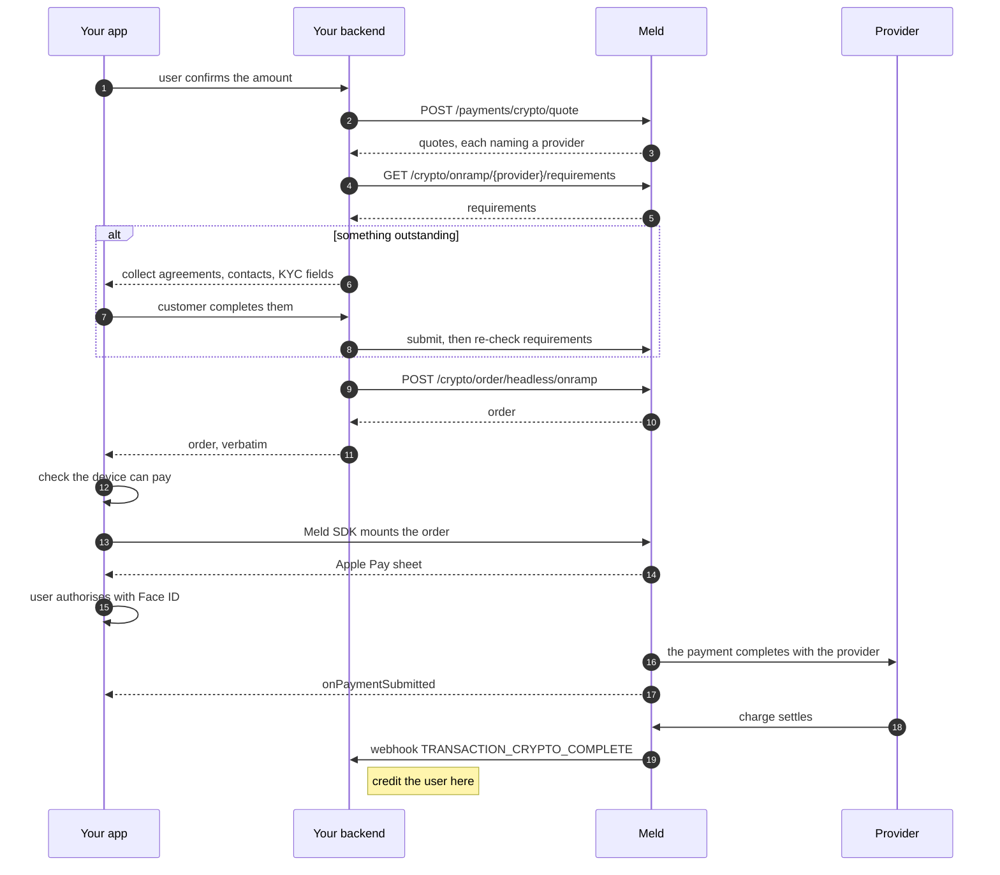

Your backend creates the order, the [Meld SDK](/docs/stablecoins/headless-integration/sdks) presents it, and settlement arrives by webhook. The integration is the same for every provider: one create call, one `mount`, the same callbacks and webhooks. The provider only changes what you set up once and what the customer needs before the order.

## Providers

| Provider | Customers | Before the order | Apple setup | Clients | The customer sees |
| --- | --- | --- | --- | --- | --- |
| Mercuryo, Banxa | Countries in the quote | [Unified KYC](/docs/stablecoins/unified-kyc) | Merchant identifier, certificate from Meld's CSR | iOS, React Native, web | The Apple Pay sheet |
| Stripe | US except New York, paying USD | [Unified KYC](/docs/stablecoins/unified-kyc), and an email on the customer | Merchant identifier, certificate from Stripe's CSR | iOS, React Native on iOS | Stripe's Link sign-in and identity checks, then the Apple Pay sheet |
| Coinbase | US, paying USD | A verified email and US mobile number, and Coinbase's agreements | None | iOS 16 or later, React Native on iOS | The Apple Pay sheet |

[Eligibility](/docs/stablecoins/headless-integration/shared-flows/eligibility) tells you what a provider still needs for a given customer, so you don't have to hardcode the column above.

### Stripe

- **Credentials.** In production, Stripe orders run on your own Stripe account. Stripe onboards it for its embedded crypto onramp and registers your app as a trusted application. Then add your Stripe keys to your Meld account as in [provider setup](/docs/stablecoins/for-all-products/service-provider-setup), together with the Link OAuth client ID, client secret and headless API version Stripe gives you, and point a Stripe webhook for `crypto.onramp_session.updated` at the webhook URL the Meld dashboard shows for the integration. In sandbox, Meld provides the Stripe integration: see [Headless testing](/docs/stablecoins/sandbox-guide/headless-testing#apple-pay-with-stripe).
- **Link.** Stripe signs the customer in to Link with the email on the Meld customer, and sends the one-time code to the phone on that Link account.
- **Identity.** Stripe runs its own KYC, and the SDK fills it from Unified KYC, so the customer only types their SSN. Meld doesn't refuse a Stripe order without Unified KYC, but the customer then fills in Stripe's forms by hand. Stripe can also ask for an ID document or a selfie, depending on the amount and its own risk checks.
- **Cards.** `CREDIT_DEBIT_CARD` runs the same flow, with Stripe collecting the card. It needs no Apple setup.

### Coinbase

- **Merchant of record.** Coinbase takes the payment on its own checkout, and the SDK opens Coinbase's Apple Pay sheet from it. You need no Apple setup.
- **Before the order.** Verify the email and phone with `serviceProvider: "COINBASEPAY"`, and record the customer's acceptance of Coinbase's agreements. Both are in [Eligibility](/docs/stablecoins/headless-integration/shared-flows/eligibility).
- **Limits.** Coinbase caps each customer weekly and over their lifetime. Over the lifetime cap, the order is refused with `CUSTOMER_NOT_PAYMENT_READY` until the customer completes the `limitUpgrade` [process](/docs/stablecoins/headless-integration/shared-flows/eligibility#provider-processes).
- **Quote.** Send `walletAddress` on the [headless quote](/docs/stablecoins/headless-integration/shared-flows/quotes), so Coinbase prices the same checkout the order uses.
- **Settlement.** Meld creates the transaction once Coinbase reports the payment, usually a minute or more after `onPaymentSubmitted`. An order the customer never pays sends no webhook.
- **Sandbox.** Sandbox covers everything up to creating the order. The current SDKs can't present a sandbox Coinbase order (it ends in `PRESENTATION_FAILED`), so test the sheet in production with a small order.

---

## Before you begin

1. [Create the customer](/docs/stablecoins/unified-kyc/meld-kyces-the-user#step-1-create-a-meld-customer), and give them what the provider needs before the order (see [Providers](#providers))
2. [Configure webhooks](/docs/stablecoins/headless-integration/shared-flows/configure-webhooks)
3. Do the Apple setup below, once per provider that needs it

---

## Apple Developer setup

Mercuryo, Banxa and Stripe need a merchant identifier and a payment processing certificate. Coinbase needs neither.

**You will need:**

- An Apple Developer account with admin rights on your team
- The payment processing CSR, which your Meld representative provides. For Stripe, see [Stripe's certificate](#stripes-certificate)
- Xcode, to add the capability and regenerate provisioning profiles

<Steps>
  <Step title="Create a merchant identifier">
    A merchant identifier names your app to Apple Pay. It lives under your Apple Developer account, not Meld's.

    1. Go to [Certificates, Identifiers & Profiles](https://developer.apple.com/account/resources/identifiers/list)
    2. Click **Identifiers** in the sidebar, then **+**
    3. Select **Merchant IDs**, then **Continue**
    4. Enter a description and an identifier — it must start with `merchant.` (e.g. `merchant.com.yourcompany.yourapp`)
    5. Click **Continue**, review, then **Register**

    If your app already has a merchant identifier, reuse it, unless another processor's certificate is on it. See [Supporting more than one provider](#supporting-more-than-one-provider).

    Give your Meld representative the identifier for each environment you use. Meld configures it on your account, and your orders carry it to the SDK. Send it well before your first order in that environment.
  </Step>
  <Step title="Create a payment processing certificate">
    This certificate is what the Apple Pay token is encrypted to. It must be created from a CSR **Meld provides** — never generate your own for this step, because the processor holds the matching private key.

    Once you have the `.certSigningRequest` file from your Meld representative:

    1. Go to [Certificates, Identifiers & Profiles](https://developer.apple.com/account/resources/identifiers/list)
    2. Click **Identifiers**, filter by **Merchant IDs**, and select the one from Step 1
    3. Under **Apple Pay Payment Processing Certificate**, click **Create Certificate**
    4. Upload the `.certSigningRequest` file Meld provided
    5. Click **Continue**, then **Download** to save the `.cer` file
    6. Send the `.cer` file back to your Meld representative

    Meld passes it to the processor. Wait for confirmation before going further — payments fail until the processor holds it.
  </Step>
  <Step title="Configure Xcode">
    1. Open your project in Xcode and select your app target
    2. Go to the **Signing & Capabilities** tab
    3. Click **+ Capability** and select **Apple Pay**
    4. Under the Apple Pay capability, click **+** and add the merchant identifier from Step 1
    5. Regenerate provisioning profiles

    On React Native, the [Expo config plugin](/docs/stablecoins/headless-integration/sdks/react-native) does this for you — pass the same merchant identifier.
  </Step>
</Steps>

<Note>
  **Certificate expiry.** Apple payment processing certificates expire every 25 months. When yours approaches expiry, repeat Step 2 — Meld will provide a fresh CSR. An expired certificate fails every payment.
</Note>

### Supporting more than one provider

Use one merchant identifier per processor. Apple encrypts a merchant identifier's tokens to a single payment processing certificate, so two processors cannot share one. If you offer Apple Pay through two providers, run the setup once for each, with its own identifier.

Your app's Apple Pay entitlement must hold every identifier: add each in Step 3, or list each in the Expo plugin's `merchantIds`. The sheet does not open for an identifier the entitlement lacks.

### Stripe's certificate

Stripe decrypts the token, so the certificate comes from a CSR issued by the Stripe account the order runs on:

- **Production:** your Stripe account. Download the CSR from the Stripe Dashboard's [iOS certificate settings](https://dashboard.stripe.com/settings/ios_certificates), and upload the `.cer` file Apple returns to Stripe, not to Meld.
- **Sandbox:** Meld's Stripe sandbox. Your Meld representative gives you the CSR, and you send them the `.cer` file.

Use a separate merchant identifier for each environment. Until Meld has configured it, Stripe Apple Pay orders in that environment fail with `400 PAYMENT_METHOD_NOT_SUPPORTED`.

### Registering your domain — web only

On the web there is no native sheet: the button renders on **your** origin, so that origin has to be registered with the provider before Apple will let it present one.

Registration is not self-serve. **Contact your Meld representative with the domains you need registered** — Meld brokers each one with the provider, so allow for a round trip per domain, and do it before you plan to go live. Every domain you serve the button from needs its own registration, staging included.

Native-only integrations skip this entirely.

---

## Flow overview

<Frame caption="An Apple Pay purchase, with the system sheet presented over the app">
  <video controls playsInline muted preload="metadata" style={{ width: "100%", maxWidth: "416px", margin: "0 auto", display: "block" }}>
    <source src="/images/headless/banxa-apple-pay.mp4" type="video/mp4" />
  </video>
</Frame>

Your servers handle the order and never see payment credentials. The SDK presents whatever the order carries: the sheet itself, the provider's own SDK, or the provider's checkout.


```mermaid
sequenceDiagram
    autonumber
    participant App as Your app
    participant Api as Your backend
    participant Meld
    participant P as Provider

    App->>Api: user confirms the amount
    Api->>Meld: POST /payments/crypto/quote
    Meld-->>Api: quotes, each naming a provider
    Api->>Meld: GET /crypto/onramp/{provider}/requirements
    Meld-->>Api: requirements
    alt something outstanding
        Api-->>App: collect agreements, contacts, KYC fields
        App->>Api: customer completes them
        Api->>Meld: submit, then re-check requirements
    end

    Api->>Meld: POST /crypto/order/headless/onramp
    Meld-->>Api: order
    Api-->>App: order, verbatim

    App->>App: check the device can pay
    App->>Meld: Meld SDK mounts the order
    Meld-->>App: Apple Pay sheet
    App->>App: user authorises with Face ID
    Meld->>P: the payment completes with the provider
    Meld-->>App: onPaymentSubmitted
    P->>Meld: charge settles
    Meld->>Api: webhook TRANSACTION_CRYPTO_COMPLETE
    Note right of Api: credit the user here
```

---

## 1. Quote, then check eligibility

Every order starts here, not just the first one.

[Get a quote](/docs/stablecoins/headless-integration/shared-flows/quotes) with `integrationMode=HEADLESS`. It prices the order, names the providers that can take it, and carries the `destinationNetworkCode` the order needs. Then [check eligibility](/docs/stablecoins/headless-integration/shared-flows/eligibility) for the provider you picked, and collect whatever is outstanding before you create the order.

---

## 2. Create the order

**Endpoint:** [`POST /crypto/order/headless/onramp`](/api-reference/crypto/headless/crypto-order-headless-onramp-create)

**Headers:** `Meld-Version: 2026-05-01`, `X-Idempotency-Key: <uuid>`

```json
{
  "customerId": "WmYYgvN8ukpV62N3m4u3ee",
  "externalOrderId": "order-3ba9f1",
  "serviceProvider": "MERCURYO",
  "paymentMethodType": "APPLE_PAY",
  "countryCode": "FR",
  "sourceAmount": "100",
  "sourceCurrencyCode": "EUR",
  "destinationCurrencyCode": "USDC",
  "destinationWalletAddress": "0x51FB80013111111111111112121111111",
  "destinationNetworkCode": "ETH",
  "clientIpAddress": "203.0.113.24"
}
```

Carry the quote's values through unchanged, and send the customer's public IP as `clientIpAddress`. Creating the order charges nothing.

Response, for this Mercuryo order. `...` marks values elided here:

```json
{
  "id": "WoRdErabcexample0000002",
  "customerId": "WmYYgvN8ukpV62N3m4u3ee",
  "externalOrderId": "order-3ba9f1",
  "paymentMethodType": "APPLE_PAY",
  "responseKind": "SESSION",
  "paymentMethodResponseDetails": {
    "presentation": "NATIVE_TOKEN",
    "sessionToken": "...",
    "merchantTransactionId": "...",
    "merchantIdentifier": "merchant.com.yourcompany.app"
  },
  "payload": { "...": "echo of your request" },
  "paymentActions": { "...": "read by the SDK" },
  "headlessPresentation": {
    "surface": "NATIVE_TOKEN",
    "protocol": "MELD_WALLET_TOKEN",
    "version": 1
  }
}
```

`paymentMethodResponseDetails` and `headlessPresentation` depend on the provider: a Stripe order carries a bootstrap for Stripe's SDK, and a Coinbase order a link to Coinbase's checkout. You don't read them. Return the whole order to your client verbatim, and don't log it: it carries short-lived credentials for this order.

---

## 3. Present the sheet

Check the device can pay before you offer the button, then hand the order to the [SDK](/docs/stablecoins/headless-integration/sdks).

<CodeGroup>

```tsx React Native
import { Meld, MeldWidget } from '@meldcrypto/react-native-sdk';

if (await Meld.canPresentApplePay()) {
  // show the Apple Pay button
}

<MeldWidget
  order={order}
  applePay={{
    amount: '100.00',            // must match the order
    currencyCode: 'EUR',
    email: customerEmail,        // used only when the sheet returns none
    summaryItemLabel: 'Acme — Buy USDC',
  }}
  onPaymentSubmitted={onPaymentSubmitted}
  onCancel={onCancel}
  onError={onError}
/>
```

```swift iOS
import MeldSDK

guard Meld.canPresentApplePay() else {
    // No card in Wallet, or Apple Pay is restricted. Fall back to card.
    return
}

let handle = try Meld.mount(order, applePay: MeldApplePayRequest(
    amount: 100.00,
    currencyCode: "EUR",                  // must match the order
    email: customerEmail,                 // used only when the sheet returns none
    summaryItemLabel: "Acme — Buy USDC"
), handlers: MeldEventHandlers(
    onReady:            { _ in },
    onPaymentSubmitted: { _ in showProcessing() },
    onStatusChange:     { status in track(status) },
    onCancel:           { _ in backToAmount() },
    onError:            { error in showError(error.message) }
))
```

```js Web
import Meld from '@meldcrypto/sdk';

// The provider's component renders its own Apple Pay button and opens the sheet from
// that tap — Apple requires the gesture inside the frame holding the merchant session.
// Do not render a button of your own in front of it.
Meld.mount(order, document.getElementById('checkout'), {
  onReady:            ()  => hideSpinner(),
  onPaymentSubmitted: ()  => showProcessing(),
  onCancel:           ()  => backToAmount(),
  onError:            (e) => showError(e.message),
});
```

</CodeGroup>

On React Native and iOS, pass the Apple Pay inputs for every Apple Pay order. They carry what the sheet shows that the order does not, and they must match the order's amount and currency. On the web there is nothing to pass: the provider's component draws the button.

A native sheet draws nothing into your view. On React Native, keep the component mounted anyway: see [Mount the order](/docs/stablecoins/headless-integration/sdks/react-native#mount-the-order).

`onCancel` fires when the user dismisses the sheet. Return them to the amount screen. Every `onError` code, and whether a payment may exist, is in [Error codes](/docs/stablecoins/headless-integration/sdks/ios#error-codes).

Stripe and Coinbase run only in an iOS app. Check [`Meld.capabilities`](/docs/stablecoins/headless-integration/sdks#check-before-you-mount) before you offer the button.

---

## 4. Settlement

`onPaymentSubmitted` means the user authorised the payment. Authorisation is not settlement.

Unmount when it fires and move the user to your own processing screen. Credit them when Meld's [`TRANSACTION_CRYPTO_COMPLETE` webhook](/docs/stablecoins/headless-integration/shared-flows/configure-webhooks) reaches your backend. No SDK event tells you the money moved.

---

## Errors on order creation

Errors use the [standard envelope](/docs/meld-api/error-responses). Unless the table says otherwise, nothing was charged.

| HTTP | `code` | Cause | What to do |
| --- | --- | --- | --- |
| `400` | `PAYMENT_METHOD_NOT_SUPPORTED` | No headless Apple Pay route for this provider, country, currency pair and network. For Stripe, also: the integration's keys don't match its environment, or Meld has no Stripe merchant identifier for you in this environment | Re-quote with `integrationMode=HEADLESS` and send its values unchanged, or offer card. For Stripe, see [Stripe's certificate](#stripes-certificate) |
| `400` | `HEADLESS_NOT_SUPPORTED` | The order doesn't match a headless route for the provider, or headless isn't available for it on your account | Re-quote and send its values unchanged. If it persists, contact your Meld representative |
| `400` | `INVALID_CRYPTO_CURRENCY` | `destinationNetworkCode` is missing | Send the quote's `destinationNetworkCode`, with a new `X-Idempotency-Key` |
| `400` | `ACCOUNT_BAD_CONFIGURATION` | The provider's integration on your account is incomplete, for example a Stripe integration without its Link OAuth client or headless API version | Complete it in the Meld dashboard |
| `400` | `TRANSACTION_REQUEST_VALIDATION_ERROR` | A field is invalid, for example an `agreementAcceptedAt` that can't be parsed or is in the future | Fix the field |
| `403` | `WHITELABEL_NOT_ENABLED` | Headless onramps aren't enabled on your account in this environment | Contact your Meld representative |
| `403` | `SERVICE_PROVIDER_NOT_ENABLED` | Your account has no credentials for the provider | See [provider credentials](/docs/stablecoins/headless-integration#provider-credentials) |
| `403` | `VERIFICATION_REQUIRED` | `errors` lists what the customer still needs: `email`, `phone` or `agreement`, each `MISSING` or `STALE` | Complete what is listed, as in [Eligibility](/docs/stablecoins/headless-integration/shared-flows/eligibility), then resend |
| `403` | `LEGAL_ACCEPTANCE_REQUIRED` | Only the provider's agreements are unmet | [Record the acceptance](/docs/stablecoins/headless-integration/shared-flows/eligibility#legal-agreements), then resend |
| `403` | `KYC_NOT_COMPLETED` | The provider hasn't approved the customer | Re-check eligibility before retrying |
| `409` | `HEADLESS_PAYMENT_OUTCOME_UNKNOWN` | Meld couldn't confirm with the provider whether the order started | Create a new order rather than retrying in a loop |
| `422` | `CUSTOMER_NOT_PAYMENT_READY` | The customer reached a provider limit. `errors` names the [process](/docs/stablecoins/headless-integration/shared-flows/eligibility#provider-processes) that raises it, for example `limitUpgrade: REQUIRED` | Run the process, then resend |
| `422` | `HEADLESS_PROVIDER_REJECTED` | The provider refused the order, and the order is spent. Stripe reports this as `STRIPE_HEADLESS_PROVIDER_REJECTED` | Create a new order with a new `X-Idempotency-Key` and `externalOrderId`. If `errors` lists `email: REJECTED` or `phone: REJECTED`, verify that channel again first. If every order fails, check the provider account's setup |
| `425` | `HEADLESS_PAYMENT_IN_PROGRESS` | The same request is still being processed | Retry shortly with the same `X-Idempotency-Key` |
| `500` | `CUSTOMER_VERIFICATION_UNAVAILABLE` | Meld couldn't check the customer's verification | Retry the same request later |

---

## Troubleshooting

| Symptom | Cause |
| --- | --- |
| Sheet does not appear | No card in Wallet, or the build's Apple Pay entitlement is missing or lacks the merchant identifier the order carries |
| Sheet appears, payment always declines | The processing certificate never got back to the processor |
| Payment fails from the iOS Simulator | The Simulator can't produce a usable Apple Pay token. Test on a physical device |
| `404` naming a service-provider customer | Usually a missing `email` on the Meld customer, occasionally missing KYC |
| `400` / `409` on `externalOrderId` | Reused value. Generate a fresh one per attempt |
| `INVALID_REDIRECT_URL` | You sent `redirectUrl`. Headless surfaces render in place, so the field is rejected |
| Surface never becomes ready | Content Security Policy on web, or a provider host not reachable from the device |
| User paid, no crypto yet | Normal while settlement runs. Wait for the webhook before showing a failure |

---

## Test in sandbox

See [Headless testing](/docs/stablecoins/sandbox-guide/headless-testing#test-apple-pay).
