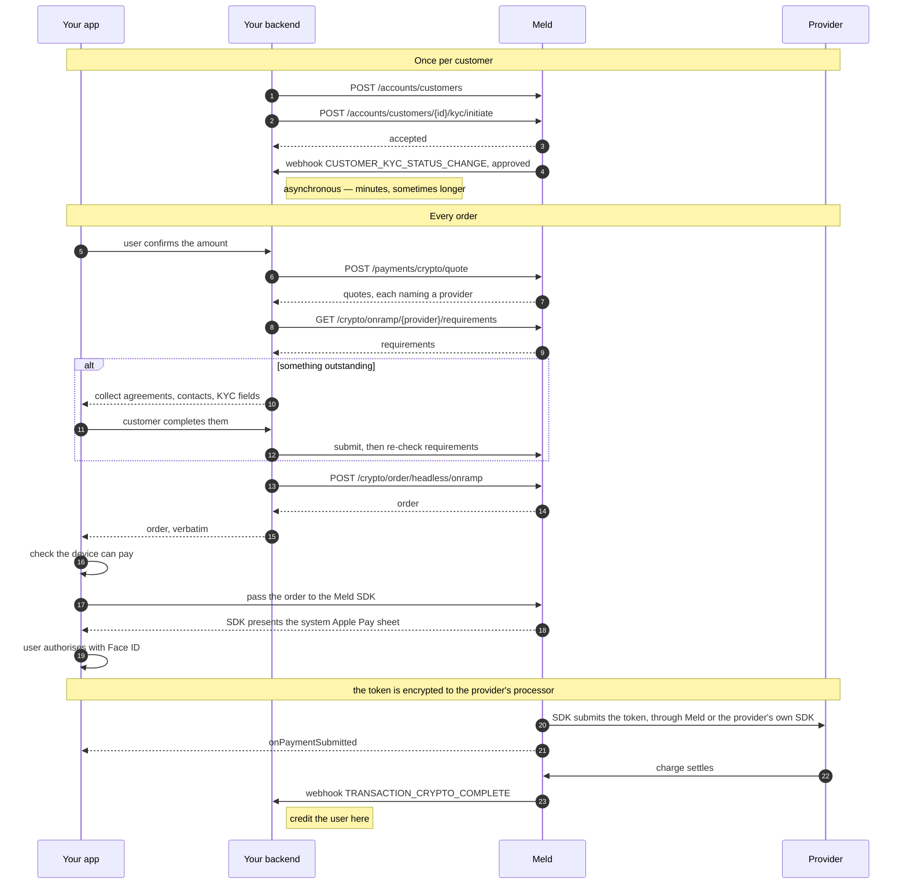

Your backend mints the order, the [Meld SDK](/docs/stablecoins/headless-integration/sdks) presents the sheet, and settlement arrives by webhook.

## Before you begin

1. [Create a customer](/docs/stablecoins/unified-kyc/meld-kyces-the-user#step-1-create-a-meld-customer) and complete [Unified KYC](/docs/stablecoins/unified-kyc). Required — almost every provider refuses an order for a customer Meld has not cleared
2. [Configure webhooks](/docs/stablecoins/headless-integration/shared-flows/configure-webhooks), before KYC so you receive status changes while it runs

Stripe is the exception to step 1. Meld runs no KYC for it: Stripe verifies the customer inside the flow its SDK presents, and needs only an email on the Meld customer. See [Stripe](#stripe).

---

## Apple Developer setup

Whether you need any depends on how the provider presents the sheet.

| How the sheet is presented | Providers today | Setup |
| --- | --- | --- |
| Natively, by your app | Mercuryo, Banxa | Merchant identifier, payment processing certificate, Apple Pay entitlement |
| Natively, by the provider's own SDK | Stripe | Your own merchant identifier, a payment processing certificate issued from Stripe's CSR, Apple Pay entitlement. See [Stripe setup](#stripe-setup) |
| By the provider, as merchant of record on a page it hosts | Coinbase | None |

You never branch on this in code — the SDK presents whichever surface the order carries. It only decides what you register with Apple up front, so do it once, before your first order with the provider concerned.

**You will need:**

- An Apple Developer account with admin rights on your team
- The payment processing CSR, which your Meld representative provides. For Stripe, your own Stripe Dashboard provides it
- Xcode, to add the capability and regenerate provisioning profiles

<Steps>
  <Step title="Create a merchant identifier">
    A merchant identifier names your app to Apple Pay. It lives under your Apple Developer account, not Meld's.

    1. Go to [Certificates, Identifiers & Profiles](https://developer.apple.com/account/resources/identifiers/list)
    2. Click **Identifiers** in the sidebar, then **+**
    3. Select **Merchant IDs**, then **Continue**
    4. Enter a description and an identifier — it must start with `merchant.` (e.g. `merchant.com.yourcompany.yourapp`)
    5. Click **Continue**, review, then **Register**

    If your app already has a merchant identifier, reuse it, unless another processor's certificate is on it. See [Supporting more than one provider](#supporting-more-than-one-provider).

    Give your Meld representative the identifier for each environment you use. Meld configures it on your account, and your orders carry it to the SDK. Send it well before your first order in that environment.
  </Step>
  <Step title="Create a payment processing certificate">
    This certificate is what the Apple Pay token is encrypted to. It must be created from a CSR **Meld provides** — never generate your own for this step, because the processor holds the matching private key. For Stripe, the CSR comes from your Stripe account instead — see [Stripe setup](#stripe-setup).

    Once you have the `.certSigningRequest` file from your Meld representative:

    1. Go to [Certificates, Identifiers & Profiles](https://developer.apple.com/account/resources/identifiers/list)
    2. Click **Identifiers**, filter by **Merchant IDs**, and select the one from Step 1
    3. Under **Apple Pay Payment Processing Certificate**, click **Create Certificate**
    4. Upload the `.certSigningRequest` file Meld provided
    5. Click **Continue**, then **Download** to save the `.cer` file
    6. Send the `.cer` file back to your Meld representative

    Meld passes it to the processor. Wait for confirmation before going further — payments fail until the processor holds it.
  </Step>
  <Step title="Configure Xcode">
    1. Open your project in Xcode and select your app target
    2. Go to the **Signing & Capabilities** tab
    3. Click **+ Capability** and select **Apple Pay**
    4. Under the Apple Pay capability, click **+** and add the merchant identifier from Step 1
    5. Regenerate provisioning profiles

    On React Native, the [Expo config plugin](/docs/stablecoins/headless-integration/sdks/react-native) does this for you — pass the same merchant identifier.
  </Step>
</Steps>

<Note>
  **Certificate expiry.** Apple payment processing certificates expire every 25 months. When yours approaches expiry, repeat Step 2 — Meld will provide a fresh CSR. An expired certificate fails every payment.
</Note>

### Supporting more than one provider

Use one merchant identifier per processor. Apple encrypts a merchant identifier's tokens to a single payment processing certificate, so two processors cannot share one. If you offer Apple Pay through two providers, run the setup once for each, with its own identifier.

Your app's Apple Pay entitlement must hold every identifier: add each in Step 3, or list each in the Expo plugin's `merchantIds`. The sheet does not open for an identifier the entitlement lacks.

### Stripe setup

Stripe's SDK presents the sheet under **your** merchant identifier, and Stripe decrypts the token, so the CSR comes from Stripe, not Meld:

- In your Stripe Dashboard, open the [iOS certificate settings](https://dashboard.stripe.com/settings/ios_certificates), add an application and download the CSR. Upload it in Step 2.
- Upload the `.cer` file Apple returns to Stripe, not to Meld. Renew the same way when the certificate nears expiry.

Do this once for each Stripe environment you use: your Stripe sandbox for Meld's sandbox, and your live Stripe account for production. Each issues its own CSR, so each needs its own merchant identifier. Download the sandbox CSR inside your Stripe sandbox, and upload the `.cer` file back to that sandbox. Certificates you add to your live account do not carry over to it.

Give your Meld representative the merchant identifier for each environment. Until Meld has configured it, Stripe Apple Pay orders in that environment fail with `400 PAYMENT_METHOD_NOT_SUPPORTED`. Stripe card orders need no merchant identifier.

### Registering your domain — web only

On the web there is no native sheet: the button renders on **your** origin, so that origin has to be registered with the provider before Apple will let it present one.

Registration is not self-serve. **Contact your Meld representative with the domains you need registered** — Meld brokers each one with the provider, so allow for a round trip per domain, and do it before you plan to go live. Every domain you serve the button from needs its own registration, staging included.

Native-only integrations skip this entirely.

---

## Flow overview

<Frame caption="An Apple Pay purchase, with the system sheet presented over the app">
  <video controls playsInline muted preload="metadata" style={{ width: "100%", maxWidth: "416px", margin: "0 auto", display: "block" }}>
    <source src="/images/headless/banxa-apple-pay.mp4" type="video/mp4" />
  </video>
</Frame>

The sheet is presented on the device, and the wallet token goes to the provider's processor, encrypted. Your servers handle the order; they never see payment credentials.

The diagram shows the path for sheets the Meld SDK presents itself, as for Mercuryo and Banxa. Stripe runs a longer flow inside its own SDK. See [Stripe](#stripe).


```mermaid
sequenceDiagram
    autonumber
    participant App as Your app
    participant Api as Your backend
    participant Meld
    participant P as Provider

    Note over App,P: Once per customer
    Api->>Meld: POST /accounts/customers
    Api->>Meld: POST /accounts/customers/{id}/kyc/initiate
    Meld-->>Api: accepted
    Meld->>Api: webhook CUSTOMER_KYC_STATUS_CHANGE, approved
    Note right of Api: asynchronous — minutes, sometimes longer

    Note over App,P: Every order
    App->>Api: user confirms the amount
    Api->>Meld: POST /payments/crypto/quote
    Meld-->>Api: quotes, each naming a provider
    Api->>Meld: GET /crypto/onramp/{provider}/requirements
    Meld-->>Api: requirements
    alt something outstanding
        Api-->>App: collect agreements, contacts, KYC fields
        App->>Api: customer completes them
        Api->>Meld: submit, then re-check requirements
    end

    Api->>Meld: POST /crypto/order/headless/onramp
    Meld-->>Api: order
    Api-->>App: order, verbatim

    App->>App: check the device can pay
    App->>Meld: pass the order to the Meld SDK
    Meld-->>App: SDK presents the system Apple Pay sheet
    App->>App: user authorises with Face ID
    Note over App,P: the token is encrypted to the provider's processor
    Meld->>P: SDK submits the token, through Meld or the provider's own SDK
    Meld-->>App: onPaymentSubmitted
    P->>Meld: charge settles
    Meld->>Api: webhook TRANSACTION_CRYPTO_COMPLETE
    Note right of Api: credit the user here
```

---

## 1. Quote, then check eligibility

Every order starts here, not just the first one.

[Get a quote](/docs/stablecoins/headless-integration/shared-flows/quotes) — it prices the order, names the providers that can take it, and carries the `destinationNetworkCode` the order needs. Then [check eligibility](/docs/stablecoins/headless-integration/shared-flows/eligibility) for the provider you picked: agreements to show, a [verified email or phone](/docs/stablecoins/headless-integration/shared-flows/verification) to collect, KYC the provider still wants. Collect whatever is outstanding before you mint the order, or the rejection lands after the customer thinks they are done.

---

## 2. Create the order

**Endpoint:** [`POST /crypto/order/headless/onramp`](/api-reference/crypto/headless/crypto-order-headless-onramp-create)

**Headers:** `Meld-Version: 2026-05-01`, `X-Idempotency-Key: <uuid>`

```json
{
  "customerId": "WmYYgvN8ukpV62N3m4u3ee",
  "externalOrderId": "order-3ba9f1",
  "serviceProvider": "MERCURYO",
  "paymentMethodType": "APPLE_PAY",
  "countryCode": "FR",
  "sourceAmount": "100",
  "sourceCurrencyCode": "EUR",
  "destinationCurrencyCode": "USDC",
  "destinationWalletAddress": "0x51FB80013111111111111112121111111",
  "destinationNetworkCode": "ETH",
  "clientIpAddress": "203.0.113.24"
}
```

Send the customer's public IP as `clientIpAddress`. The SDK takes the IP and the destination wallet from the order, so you do not pass them to it again.

Response, for this Mercuryo order. `...` marks values elided here:

```json
{
  "id": "WoRdErabcexample0000002",
  "customerId": "WmYYgvN8ukpV62N3m4u3ee",
  "externalOrderId": "order-3ba9f1",
  "paymentMethodType": "APPLE_PAY",
  "responseKind": "SESSION",
  "paymentMethodResponseDetails": {
    "presentation": "NATIVE_TOKEN",
    "sessionToken": "...",
    "merchantTransactionId": "...",
    "merchantIdentifier": "merchant.com.yourcompany.app"
  },
  "payload": { "...": "echo of your request" },
  "paymentActions": { "...": "read by the SDK" },
  "headlessPresentation": {
    "surface": "NATIVE_TOKEN",
    "protocol": "MELD_WALLET_TOKEN",
    "version": 1
  }
}
```

Return it to your client verbatim. `paymentMethodResponseDetails`, `paymentActions` and `headlessPresentation` carry what the SDK needs. Your app does not have to read those fields itself, but it must not drop them.

Its shape depends on the provider. A Stripe order carries a bootstrap for Stripe's SDK. See [Stripe](#create-a-stripe-order).

---

## 3. Present the sheet

Check the device can pay before you offer the button, then hand the order to the [SDK](/docs/stablecoins/headless-integration/sdks).

<CodeGroup>

```tsx React Native
import { Meld, MeldWidget } from '@meldcrypto/react-native-sdk';

if (await Meld.canPresentApplePay()) {
  // show the Apple Pay button
}

<MeldWidget
  order={order}
  applePay={{
    amount: '100.00',            // must match the order
    currencyCode: 'EUR',
    email: customerEmail,        // used only when the sheet returns none
    summaryItemLabel: 'Acme — Buy USDC',
  }}
  onPaymentSubmitted={onPaymentSubmitted}
  onCancel={onCancel}
  onError={onError}
/>
```

```swift iOS
import MeldSDK

guard Meld.canPresentApplePay() else {
    // No card in Wallet, or Apple Pay is restricted. Fall back to card.
    return
}

let handle = try Meld.mount(order, applePay: MeldApplePayRequest(
    amount: 100.00,
    currencyCode: "EUR",                  // must match the order
    email: customerEmail,                 // used only when the sheet returns none
    summaryItemLabel: "Acme — Buy USDC"
), handlers: MeldEventHandlers(
    onReady:            { _ in },
    onPaymentSubmitted: { _ in showProcessing() },
    onStatusChange:     { status in track(status) },
    onCancel:           { _ in backToAmount() },
    onError:            { error in showError(error.message) }
))
```

```js Web
import Meld from '@meldcrypto/sdk';

// The provider's component renders its own Apple Pay button and opens the sheet from
// that tap — Apple requires the gesture inside the frame holding the merchant session.
// Do not render a button of your own in front of it.
Meld.mount(order, document.getElementById('checkout'), {
  onReady:            ()  => hideSpinner(),
  onPaymentSubmitted: ()  => showProcessing(),
  onCancel:           ()  => backToAmount(),
  onError:            (e) => showError(e.message),
});
```

</CodeGroup>

On React Native and iOS, pass the Apple Pay inputs for every Apple Pay order, so your app never branches on the provider. They carry what the sheet shows and the order does not. On a Stripe order they must match the order's amount, in USD. On the web there is nothing extra to pass: the order carries it, and the provider's component draws the button.

A native sheet draws nothing into your view, because iOS puts it over your screen. The React Native component still has to stay mounted for as long as the sheet is up. A zero-size component, mounted from the customer's tap, is enough.

`onCancel` fires when the user dismisses the sheet. Treat it as a change of mind and return them to the amount screen.

<Note>
  Not every provider's Apple Pay works on every platform. Stripe runs only in an iOS app. Call `Meld.capabilities(order)` (`Meld.capabilities(for: order)` on iOS) before you offer the button, and fall back when its `surface` is `unsupported`. An order the SDK cannot present reports that rather than failing at mount.
</Note>

---

## 4. Settlement

`onPaymentSubmitted` means the user authorised the sheet. Authorisation is not settlement.

Unmount when it fires and move the user to your own processing screen. Credit them when Meld's [`TRANSACTION_CRYPTO_COMPLETE` webhook](/docs/stablecoins/headless-integration/shared-flows/configure-webhooks) reaches your backend — no SDK event tells you the money moved.

---

## Stripe

Stripe runs the purchase in its own SDK — Link sign-in, identity checks, the Apple Pay sheet and checkout — and the Meld SDK drives it. Your backend's part does not change: quote, create the order, return it verbatim. Stripe card orders run the same flow; [Cards](/docs/stablecoins/headless-integration/cards#stripe) covers the one difference.

### Scope

| | Stripe headless |
| --- | --- |
| Customers | US only, excluding New York. Stripe decides which states it serves, and Meld does not check the state up front. Stripe refuses an unserved customer inside the flow: before payment, the SDK reports `PRESENTATION_FAILED`; at payment, see [When Stripe refuses the payment](#when-stripe-refuses-the-payment) |
| Currency | USD in. The headless quote lists the tokens and networks |
| Payment methods | `APPLE_PAY` and `CREDIT_DEBIT_CARD` |
| Clients | iOS, directly or through the [React Native SDK](/docs/stablecoins/headless-integration/sdks/react-native#stripe-orders). Not the web SDK, not Android |
| KYC | None by Meld. The headless quote reports `kycMode: PROVIDER_MANAGED`, and Stripe verifies the customer inside the flow |
| Credentials | Your own Stripe account, onboarded by Stripe for its crypto onramp and set up on Meld for headless orders. See [Before you begin](#before-you-begin-with-stripe) |
| Environments | Sandbox and production. In sandbox, use your Stripe sandbox and its test keys — see [Test Stripe](/docs/stablecoins/sandbox-guide/headless-testing#test-stripe) |

### Before you begin with Stripe

- **Stripe onboarding.** Stripe onboards your account for its embedded crypto onramp, which is in private preview. Onboarding enables the onramp and Link, provisions a Link OAuth client ID and client secret, gives you the API version for the onramp, and registers your app with Stripe as a trusted application. No Stripe call succeeds before it is complete, in a Stripe sandbox too. Meld sends each order's fee-inclusive total as `source_total_amount`, so confirm with Stripe that your account accepts it.
- **Your Stripe integration on Meld.** Add your Stripe publishable key, secret key and webhook signing secret to your Meld account, as in [provider setup](/docs/stablecoins/for-all-products/service-provider-setup). Match the integration's environment and keys to the Meld environment: on your sandbox account, set the environment to Sandbox and use test keys (`pk_test_`, `sk_test_`); in production, set it to Production and use live keys. The integration's environment decides the order's `sdkEnvironment`, so a sandbox account whose integration is set to Production creates orders the SDK refuses.
- **Headless fields.** On the same integration in the Meld dashboard, also enter the Link OAuth client ID and client secret that Stripe provisioned, and the headless API version Stripe gave you: a dated version ending in `;crypto_onramp_beta=v2`. Use the values from the same Stripe environment as your keys. The headless API version is not the widget's version on the provider setup page.
- **Stripe webhooks to Meld.** Meld settles Stripe orders only from Stripe's webhooks. In Stripe, add a webhook endpoint at the webhook URL the Meld dashboard shows for your Stripe integration, subscribed to `crypto.onramp_session.updated`, and save its signing secret as the integration's webhook secret.
- **An email on the customer.** Meld starts Link sign-in with the email on the Meld customer record. Without one, the order is refused with `403 VERIFICATION_REQUIRED`; [eligibility](/docs/stablecoins/headless-integration/shared-flows/eligibility) reports it before you create the order.
- **[Stripe setup](#stripe-setup)**, for Apple Pay.
- Unified KYC is optional. If the customer has passed it, the SDK fills Stripe's KYC from it — see [Prefill](#prefill).

### Create a Stripe order

Send the [step 2](#2-create-the-order) request with `serviceProvider: STRIPE`, `countryCode: US`, `sourceCurrencyCode: USD` and the quote's `destinationNetworkCode`. Both `destinationNetworkCode` and the `X-Idempotency-Key` header are required.

Creating the order charges nothing. Meld starts Link sign-in for the customer's email and returns a bootstrap for Stripe's SDK. This sandbox example shows every field the SDK needs; `...` marks values elided here:

```json
{
  "id": "WoRdErabcexample0000003",
  "customerId": "WmYYgvN8ukpV62N3m4u3ee",
  "externalOrderId": "order-5c71d2",
  "paymentMethodType": "APPLE_PAY",
  "responseKind": "SDK_BOOTSTRAP",
  "paymentMethodResponseDetails": {
    "sdkBootstrapType": "STRIPE_CRYPTO_ONRAMP",
    "providerIntentId": "lai_...",
    "continuationToken": "...",
    "sdkFlow": "AUTHORIZE",
    "sdkEnvironment": "SANDBOX",
    "expiresAtEpochSeconds": 1791300000,
    "clientConfiguration": {
      "publicKey": "pk_test_...",
      "walletNetwork": "ethereum",
      "merchantIdentifier": "merchant.com.yourcompany.app.stripe.sandbox"
    }
  },
  "payload": { "...": "echo of your request" },
  "paymentActions": { "...": "read by the SDK" },
  "headlessPresentation": {
    "surface": "NATIVE_SDK",
    "protocol": "STRIPE_CRYPTO_ONRAMP",
    "version": 1
  }
}
```

| Field | What it is |
| --- | --- |
| `continuationToken` | A short-lived credential for this order. Never log it |
| `expiresAtEpochSeconds` | When the bootstrap stops working. Past it, create a new order |
| `sdkEnvironment` | `SANDBOX` or `PRODUCTION`: your Stripe integration's environment setting. It must match the environment you configure the SDK for |
| `clientConfiguration.publicKey` | Your Stripe publishable key: `pk_test_` in sandbox, `pk_live_` in production |
| `clientConfiguration.merchantIdentifier` | Apple Pay only. Your Stripe merchant identifier for this environment — see [Stripe setup](#stripe-setup) |

Return the response verbatim, as with every order. The SDK refuses a Stripe order that lacks any field it needs, so a backend that forwards selected fields breaks it.

The SDK then continues the order from the device, calling Meld with the `continuationToken`. You never make those calls yourself: their outcomes reach you as [SDK callbacks](/docs/stablecoins/headless-integration/sdks/ios#stripe-orders), and settlement works as in [step 4](#4-settlement).

The SDK makes those calls to the Meld environment it is configured for, so configure it for the one you created the order in: `sandbox` for orders created on `https://api-sb.meld.io`. It also checks the order's `sdkEnvironment` and key against that setting. On a mismatch, `Meld.capabilities` reports `unsupported` and mounting throws. A sandbox order from an integration set to Production fails this way.

### The Link email is the customer's email

Meld starts Link sign-in with the email on the Meld customer record, and the SDK [prefills](#prefill) that email, so the customer normally doesn't type one. As a result:

- Link sends its code to the phone on the Link account that email belongs to, not to a number your app collected
- If the email has no Link account, the SDK registers one with it

### Prefill

The SDK fills Stripe's screens from the Meld customer, so it asks the customer for as little as it can:

| Field | Sent when | The SDK uses it to |
| --- | --- | --- |
| `email` | The customer's email is a valid address | Sign in to Link |
| `phone` | The phone is verified with Meld and in E.164 form | Register a new Link account without a form |
| `fullName` | The customer has a first and last name | Name that new Link account |
| `identity` | The customer passed [Unified KYC](/docs/stablecoins/unified-kyc): first and last name, date of birth, US residence address | Fill Stripe's first KYC request, so the customer types only what it lacks |

Prefill depends on the email. If the customer's email is not a valid address, Meld sends no prefill at all: the SDK asks for the email on its own **Sign in to Link** form, then asks for everything else.

The SSN is never prefilled. The customer types it into the SDK, which hands it straight to Stripe, so it reaches neither Meld nor your servers. If Stripe rejects a prefilled submission, the SDK shows the full form.

### When Stripe refuses the payment

Stripe can refuse to create the payment session, or fail the session afterwards, for example for an unsupported card. Meld also refuses a session from a device whose IP address is not public, before calling Stripe. In each case nothing was charged and nothing will settle. The SDK reports `onError` `PAYMENT_REJECTED`: offer another payment method or provider, on a new order.

Some refusals report `PAYMENT_OUTCOME_UNKNOWN` instead, because the device had already started the payment when they arrived:

- An amount over the customer's Stripe limit
- An identity check Stripe asks for when the session is created
- A refusal that answers the SDK's own retry of the request

No payment session exists in these cases, but the device cannot tell. Handle them like any `PAYMENT_OUTCOME_UNKNOWN`: track the order through your backend and never pay it again.

### Errors on order creation

Errors use the [standard envelope](/docs/meld-api/error-responses). On a Stripe order, these codes mean:

| HTTP | `code` | Cause | What to do |
| --- | --- | --- | --- |
| `403` | `VERIFICATION_REQUIRED` | The Meld customer has no email; `errors` names `email: MISSING` | Add one with `PATCH /accounts/customers/{customerId}`, then retry |
| `400` | `INVALID_CRYPTO_CURRENCY` | `destinationNetworkCode` is missing | Send the quote's `destinationNetworkCode`, with a new `X-Idempotency-Key` |
| `400` | `PAYMENT_METHOD_NOT_SUPPORTED` | No Stripe headless route for this country, currency pair, network and method. Or your Stripe integration cannot serve the order: it is not your account's own, its keys do not match its environment (a `pk_live_` key on an integration set to Sandbox, or the reverse), or, for Apple Pay, Meld has no merchant identifier for you in this environment | Re-quote with `integrationMode=HEADLESS` and carry its values into the order. Otherwise check your Stripe integration and, for Apple Pay, [Stripe setup](#stripe-setup) |
| `400` | `HEADLESS_NOT_SUPPORTED` | Meld's own checks refused the order before any call to Stripe: the order does not match a Stripe headless route, or Stripe headless is not available to your account | Re-quote with `integrationMode=HEADLESS` and send its values unchanged. If it persists, ask your Meld representative |
| `400` | `ACCOUNT_BAD_CONFIGURATION` | Your Stripe integration is not set up for headless orders: the Link OAuth client ID or secret, or the headless API version, is missing or malformed | Add the missing value to your Stripe integration in the Meld dashboard. See [headless fields](#before-you-begin-with-stripe) |
| `422` | `STRIPE_HEADLESS_PROVIDER_REJECTED` | Stripe refused to start Link sign-in, or you retried an order whose bootstrap had already failed or expired. Stripe's reason can be this customer, such as a Link connection they revoked, or your whole Stripe account: onboarding not complete, Link sign-in not enabled, or an invalid secret key | Nothing was charged. Create a new order. If every order fails this way, a new order will not help: check your Stripe onboarding and keys with Stripe |
| `409` | `HEADLESS_PAYMENT_OUTCOME_UNKNOWN` | Meld could not confirm with Stripe whether sign-in started | Nothing was charged. Create a new order rather than retrying in a loop |
| `425` | `HEADLESS_PAYMENT_IN_PROGRESS` | The same request is still being processed | Retry shortly with the same `X-Idempotency-Key` |

---

## Troubleshooting

| Symptom | Cause |
| --- | --- |
| Sheet does not appear | No card in Wallet, or the build's Apple Pay entitlement is missing or lacks the merchant identifier the order carries |
| Sheet appears, payment always declines | The processing certificate never got back to the processor, or the wrong key was used |
| Payment fails from the iOS Simulator | The Simulator cannot produce a usable Apple Pay token. Test on a physical device — see [sandbox testing](/docs/stablecoins/sandbox-guide/headless-testing) |
| `403` `WHITELABEL_NOT_ENABLED` | Headless onramps are not enabled on your account, in this environment. Contact your Meld representative |
| `403` `SERVICE_PROVIDER_NOT_ENABLED` | Your account has no credentials for that provider. See [provider credentials](/docs/stablecoins/headless-integration#you-bring-your-own-provider-credentials) |
| `403` `KYC_NOT_COMPLETED` | Customer not approved with that provider. Re-check requirements before retrying |
| `400` `PAYMENT_METHOD_NOT_SUPPORTED` | No headless Apple Pay route for this provider, country, currency pair and network. Re-quote with `integrationMode=HEADLESS`, or fall back to card. For Stripe, see [its errors](#errors-on-order-creation) |
| `404` naming a service-provider customer | Usually a missing `email` on the Meld customer, occasionally missing KYC. Stripe reports a missing email as `403` `VERIFICATION_REQUIRED` instead |
| `400` / `409` on `externalOrderId` | Reused value. Generate a fresh one per attempt |
| `INVALID_REDIRECT_URL` | You sent `redirectUrl`. Headless surfaces render in place, so the field is rejected |
| Surface never becomes ready | Content Security Policy on web, or a provider host not reachable from the device |
| User paid, no crypto yet | Normal while settlement runs. Wait for the webhook before showing a failure |

Errors specific to Stripe are under [Stripe](#errors-on-order-creation).

---

## Test in sandbox

Once your integration is complete, test it in Meld's sandbox, `https://api-sb.meld.io`, with the SDK configured for `sandbox`. [Headless testing](/docs/stablecoins/sandbox-guide/headless-testing) covers cards, Apple Pay and Stripe.

Sandbox has fewer providers and routes than production. Use it to prove your integration, then run your end-to-end checks in production.
