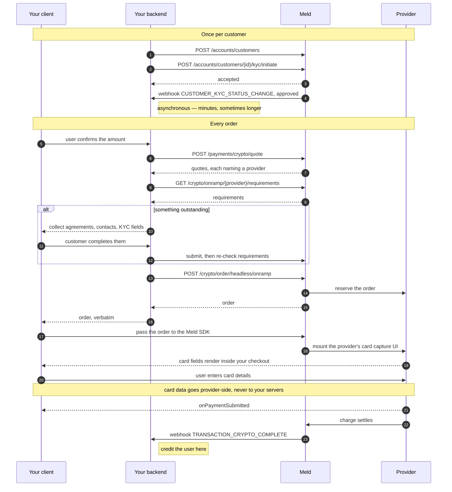

Your backend mints the order, the [Meld SDK](/docs/stablecoins/headless-integration/sdks) mounts the provider's card form inside your checkout, and settlement arrives by webhook. You own every screen around it; the card fields are the provider's, which is what keeps them out of your PCI scope.

## Before you begin

1. [Create a customer](/docs/stablecoins/unified-kyc/meld-kyces-the-user#step-1-create-a-meld-customer) and complete [Unified KYC](/docs/stablecoins/unified-kyc). Required — almost every provider refuses an order for a customer Meld has not cleared
2. [Configure webhooks](/docs/stablecoins/headless-integration/shared-flows/configure-webhooks), before KYC so you receive status changes while it runs

You also need the Meld SDK in your client. Card capture runs on the provider's PCI surface, mounted by the SDK — there is no supported path that renders a card form yourself.

---

## Flow overview

<Frame caption="A card purchase end to end, with the provider's form mounted in the app">
  <video controls playsInline muted preload="metadata" style={{ width: "100%", maxWidth: "426px", margin: "0 auto", display: "block" }}>
    <source src="/images/headless/banxa-card.mp4" type="video/mp4" />
  </video>
</Frame>



---

## 1. Quote, then check eligibility

Every order starts here, not just the first one.

[Get a quote](/docs/stablecoins/headless-integration/shared-flows/quotes) — it prices the order, names the providers that can take it, and carries the `destinationNetworkCode` the order needs. Then [check eligibility](/docs/stablecoins/headless-integration/shared-flows/eligibility) for the provider you picked: agreements to show, a [verified email or phone](/docs/stablecoins/headless-integration/shared-flows/verification) to collect, KYC the provider still wants. Collect whatever is outstanding before you mint the order, or the rejection lands after the customer thinks they are done.

---

## 2. Create the order

**Endpoint:** [`POST /crypto/order/headless/onramp`](/api-reference/crypto/headless/crypto-order-headless-onramp-create)

**Headers:** `Meld-Version: 2026-05-01`, `X-Idempotency-Key: <uuid>`

Call this from your backend. The API key never reaches the device.

```json
{
  "customerId": "WmYYgvN8ukpV62N3m4u3ee",
  "externalOrderId": "order-8f21c0",
  "serviceProvider": "MERCURYO",
  "paymentMethodType": "CREDIT_DEBIT_CARD",
  "countryCode": "FR",
  "sourceAmount": "100",
  "sourceCurrencyCode": "EUR",
  "destinationCurrencyCode": "USDC",
  "destinationWalletAddress": "0x51FB80013111111111111112121111111",
  "destinationNetworkCode": "ETH",
  "clientIpAddress": "203.0.113.24"
}
```

| Field | Required | Description |
| --- | --- | --- |
| `customerId` | yes | The Meld customer buying. `externalCustomerId` works instead |
| `externalOrderId` | yes | Your own reference for this order, unique per account |
| `serviceProvider` | yes | The provider taking the order, carried through from the quote |
| `paymentMethodType` | yes | `CREDIT_DEBIT_CARD` |
| `countryCode` | yes | Where the customer is, ISO 3166-1 alpha-2 |
| `sourceAmount` | yes | What the customer pays |
| `sourceCurrencyCode` | yes | Fiat they pay in, ISO 4217 |
| `destinationCurrencyCode` | yes | Token they are buying, as Meld names it |
| `destinationWalletAddress` | yes | Wallet it is sent to |
| `destinationNetworkCode` | yes | Chain, as Meld names it. Carry it through from the quote |
| `subdivision` | some providers | State or province, ISO 3166-2 — `US-CA`. Required where a provider is approved state by state |
| `clientIpAddress` | yes | The end user's public IP, not your server's |
| `customerPhoneNumber` | some providers | The customer's phone, where a provider wants it on the order as well as on the customer record |
| `providerData` | some providers | A provider-specific block, for the few that need something no other provider does |

Send `clientIpAddress` on every order. Some providers require it and some ignore it, nothing rejects it, and no endpoint will tell you which you have — the ones that need it fail provider-side, which reads as an opaque decline rather than a missing field.

The last two rows are different: they cannot be sent blind. Meld tells you if the provider you are enabling needs them, as part of enabling it. Until then, leave them out.

Currency and network codes are Meld's own. Meld translates them to whatever the provider calls the same asset, so the same order body works across providers and you never keep a per-provider symbol table. [Coverage](/docs/stablecoins/coverage) lists them, and the quote returns the codes it priced.

Response:

```json
{
  "id": "WoRdErabcexample0000001",
  "customerId": "WmYYgvN8ukpV62N3m4u3ee",
  "externalOrderId": "order-8f21c0",
  "paymentMethodType": "CREDIT_DEBIT_CARD",
  "paymentMethodResponseDetails": {
    "serviceProviderWidgetUrl": "https://...",
    "renderMode": "IFRAME"
  },
  "payload": { "...": "echo of your request" }
}
```

Return the response to your client **verbatim**. The SDK reads it; you do not need to interpret it, and the fields present differ by provider. Some of them are short-lived credentials scoped to the order, so log that the response arrived and not what was in it.

---

## 3. Mount the order

Hand the order to the SDK and let it present the surface.

<CodeGroup>

```js Web
import Meld from '@meldcrypto/sdk';

const handle = Meld.mount(order, document.getElementById('checkout'), {
  onReady:            () => hideSpinner(),
  onStatusChange:     (s) => track(s),
  onPaymentSubmitted: () => showProcessing(),
  onCancel:           () => backToCheckout(),
  onError:            (e) => showError(e.message),
});
```

```tsx React Native
import { MeldWidget } from '@meldcrypto/react-native-sdk';

<MeldWidget
  order={order}
  onReady={onReady}
  onStatusChange={onStatusChange}
  onPaymentSubmitted={onPaymentSubmitted}
  onCancel={onCancel}
  onError={onError}
/>
```

```swift iOS
let handle = try Meld.mount(order, into: containerView, handlers: MeldEventHandlers(
    onReady:            { _ in hideSpinner() },
    onPaymentSubmitted: { _ in showProcessing() },
    onStatusChange:     { status in track(status) },
    onCancel:           { _ in backToCheckout() },
    onError:            { error in show(error.message) }
))
```

</CodeGroup>

Keep it mounted until the user finishes paying. Tearing it down mid-flow takes the surface with it.

See the [SDK guides](/docs/stablecoins/headless-integration/sdks) for install and platform setup.

---

## 4. Settlement

`onPaymentSubmitted` means the user finished the form. It does not mean the payment cleared.

Two things to do when it fires:

- **Unmount the surface and show your own processing screen.** The provider's post-submit screen has nothing left for the user to do, and leaving them on it reads as a stall.
- **Do not credit anything yet.** Credit when Meld's [`TRANSACTION_CRYPTO_COMPLETE` webhook](/docs/stablecoins/headless-integration/shared-flows/configure-webhooks) reaches your backend. It is the only signal that the money moved; no SDK event tells you that.

---

## Troubleshooting

| Symptom | Cause |
| --- | --- |
| `403` `SERVICE_PROVIDER_NOT_ENABLED` | Your account has no credentials for that provider. See [provider credentials](/docs/stablecoins/headless-integration#you-bring-your-own-provider-credentials) |
| `403` `KYC_NOT_COMPLETED` | Customer not approved with that provider. Re-check requirements before retrying |
| `422` `COINBASE_ORDER_REJECTED` | The provider declined the order on its own limits. No order was created and nothing was charged — offer another provider rather than retrying |
| `404` naming a service-provider customer | Usually a missing `email` on the Meld customer, occasionally missing KYC |
| `400` / `409` on `externalOrderId` | Reused value. Generate a fresh one per attempt |
| `INVALID_REDIRECT_URL` | You sent `redirectUrl`. Headless card surfaces render in place, so the field is rejected |
| Surface never becomes ready | Content Security Policy on web, or a provider host not reachable from the device |
| User paid, no crypto yet | Normal while settlement runs. Wait for the webhook before showing a failure |
