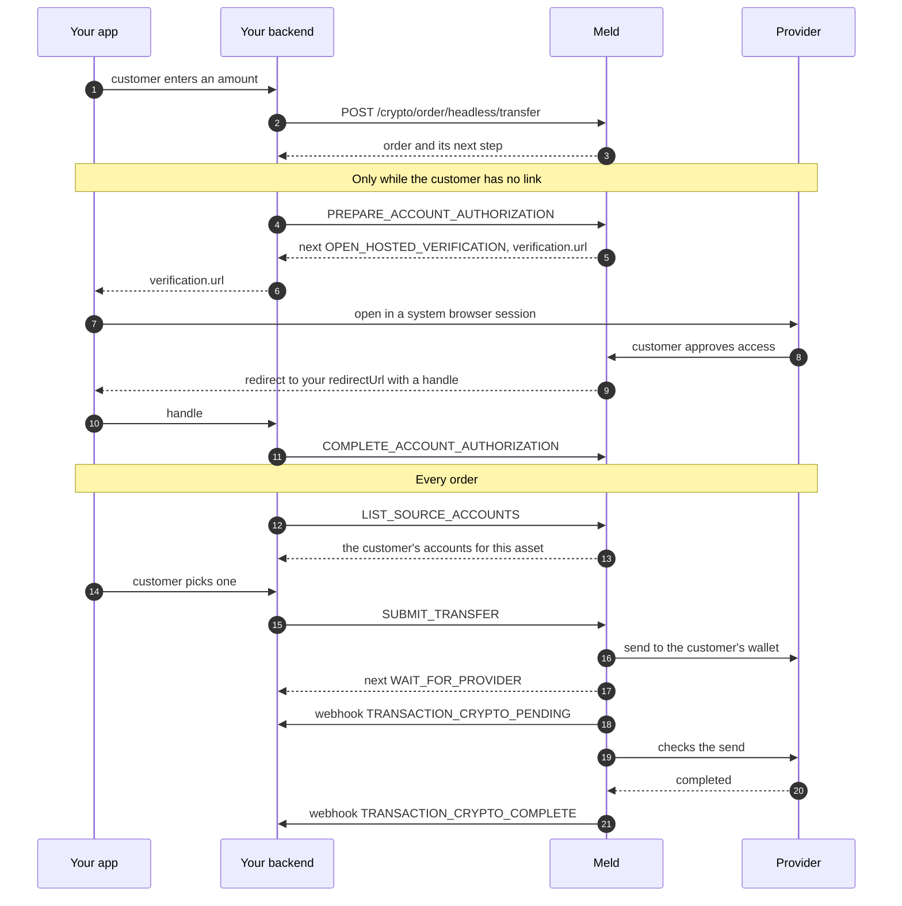

A customer links an account they hold at an exchange, then sends crypto from it to their own wallet. Coinbase is the provider today. Your backend creates the order and runs each step through Meld, and settlement arrives by webhook. There is no quote and no payment method. The only provider screen the customer sees is its sign-in and consent page, when they link their account. Every other screen is your UI.

## Scope

| | Transfers |
| --- | --- |
| Provider | Coinbase, as `serviceProvider: COINBASEPAY` |
| Customers | US only. Send `countryCode: US` |
| Assets | The assets the provider lists for transfers. See [step 1](#1-find-what-can-be-transferred) |
| KYC | None by Meld. The customer signs in to their own account at the provider |
| Clients | Mobile apps and websites. No Meld SDK is involved |
| Environments | Sandbox, where transfers are simulated, and production, where they are live. See [Test in sandbox](#test-in-sandbox) |

---

## Before you begin

1. Ask your Meld representative to enable headless and transfers on your account, in sandbox first. Each environment is enabled separately
2. [Create the customer](/docs/stablecoins/unified-kyc/meld-kyces-the-user#step-1-create-a-meld-customer)
3. [Configure webhooks](/docs/stablecoins/headless-integration/shared-flows/configure-webhooks). Transfers use the same transaction events as purchases
4. Choose a `redirectUrl`. See [Redirect URL](#redirect-url)

Run every call on this page from your backend. Your API key and each order's action token are secrets, so the device never calls Meld's API.

---

## Flow overview



---

## 1. Find what can be transferred

**Endpoint:** `GET /network-partner/supported/currencies`

```bash
curl 'https://api-sb.meld.io/network-partner/supported/currencies?category=CRYPTO_TRANSFER&country=US&partner=COINBASEPAY&type=CRYPTO' \
  -H 'Authorization: BASIC {apiKey}' \
  -H 'Accept: application/json'
```

Each row is an asset the provider can send for your account. Use the row's `currencyCode` as the order's `currencyCode`, and its `chainCode` as the order's `networkCode`, exactly as returned. For example, USDC on Base is `currencyCode: USDC_BASE` with `networkCode: BASE`.

Read the list rather than hardcoding it. An order for an asset that is not on it is refused.

---

## 2. Create the order

**Endpoint:** `POST /crypto/order/headless/transfer`

**Headers:** `Authorization: BASIC {apiKey}`, `X-Idempotency-Key: <uuid>`

```json
{
  "customerId": "WmYYgvN8ukpV62N3m4u3ee",
  "externalOrderId": "transfer-7d41a2",
  "serviceProvider": "COINBASEPAY",
  "currencyCode": "USDC_BASE",
  "networkCode": "BASE",
  "amount": 10.01,
  "destinationWalletAddress": "0x9C5f1a1b2c3d4e5f60718293a4b5c6d7e8f90a1b",
  "countryCode": "US",
  "subdivision": "US-CA",
  "redirectUrl": "https://app.example.com/coinbase/return"
}
```

| Field | Required | Description |
| --- | --- | --- |
| `customerId` | yes | The Meld customer sending the crypto. `externalCustomerId` works instead |
| `externalOrderId` | in sandbox | Your own reference for this order, unique per account. Sandbox settlement finds the order by it |
| `serviceProvider` | yes | `COINBASEPAY` |
| `currencyCode` | yes | The asset, from [step 1](#1-find-what-can-be-transferred) |
| `networkCode` | yes | The chain, from [step 1](#1-find-what-can-be-transferred) |
| `amount` | yes | The amount that arrives in the wallet, in the asset. Greater than 0, with at most 12 integer digits and 20 decimal places. The provider debits any network fee from the customer's account on top of it |
| `destinationWalletAddress` | yes | A wallet the customer owns. No spaces, at most 256 characters |
| `destinationWalletTag` | some networks | The tag or memo, for networks that use one |
| `countryCode` | yes | `US` |
| `subdivision` | no | The customer's state, ISO 3166-2, for example `US-CA` |
| `redirectUrl` | yes | Where Meld sends the customer after the provider's page. See [Redirect URL](#redirect-url) |

### Redirect URL

`redirectUrl` must be at most 2,048 characters, carry no user name or password, and be one of these:

- An absolute `https` URL, such as a universal link on iOS or an App Link on Android
- A URL on your app's custom scheme, such as `myapp://coinbase/return`. Contact Meld to use one. You need it to support iOS before 17.4, where `ASWebAuthenticationSession` cannot return to an `https` URL

Anything else is refused with `400 INVALID_REDIRECT_URL`.

### The response

Order creation returns `201`:

```json
{
  "id": "WQ7tR2kVx9bNfH4cJmPz3s",
  "customerId": "WmYYgvN8ukpV62N3m4u3ee",
  "externalOrderId": "transfer-7d41a2",
  "serviceProvider": "COINBASEPAY",
  "transferMethod": "ACCOUNT_LINK",
  "currencyCode": "USDC_BASE",
  "networkCode": "BASE",
  "amount": 10.01,
  "destinationWalletAddress": "0x9C5f1a1b2c3d4e5f60718293a4b5c6d7e8f90a1b",
  "countryCode": "US",
  "status": "CREATED",
  "providerMode": "SIMULATED",
  "headlessPresentation": {
    "surface": "PROVIDER_ACCOUNT_LINK",
    "protocol": "MELD_ACCOUNT_TRANSFER",
    "version": 1
  },
  "next": {
    "version": 1,
    "status": "NOT_STARTED",
    "nextStep": "AUTHORIZE_ACCOUNT"
  },
  "actionToken": "eyJhbGciOi...",
  "actionTokenExpiresAt": "2026-10-07T18:30:00Z",
  "paymentActions": {
    "version": 1,
    "endpoint": "/crypto/order/headless/transfer/COINBASEPAY/WQ7tR2kVx9bNfH4cJmPz3s/actions",
    "bearerTokenPointer": "/actionToken",
    "operations": [
      { "operation": "READ_SUBMISSION", "idempotencyKeyRequired": false },
      { "operation": "PREPARE_ACCOUNT_AUTHORIZATION", "idempotencyKeyRequired": true },
      { "operation": "COMPLETE_ACCOUNT_AUTHORIZATION", "idempotencyKeyRequired": true },
      { "operation": "LIST_SOURCE_ACCOUNTS", "idempotencyKeyRequired": false },
      { "operation": "SUBMIT_TRANSFER", "idempotencyKeyRequired": true },
      { "operation": "SUBMIT_SECOND_FACTOR", "idempotencyKeyRequired": true }
    ]
  }
}
```

| Field | What it is |
| --- | --- |
| `id` | Meld's order id |
| `status` | Where the order stands. See [Order status](#order-status) |
| `transactionId` | Meld's transaction id. Present once the provider has accepted the send |
| `providerMode` | `SIMULATED` in sandbox, `LIVE` in production |
| `next` | The step to take now. See [Steps](#steps) |
| `actionToken` | The bearer token for this order's action endpoint |
| `actionTokenExpiresAt` | When `actionToken` stops working |
| `paymentActions` | The action endpoint and the operations it accepts |

Fields with no value are left out.

### Retries and idempotency

Send a new `X-Idempotency-Key` for each new order.

- A retry with the same key and the same body returns `200` with the order as first created and a new `actionToken`. [Read the order](#read-the-order) for its current `next`
- A retry while the first request is still running returns `425` with `Retry-After: 2` and no body. Retry with the same key
- The same key with a different body is refused with `409 IDEMPOTENCY_KEY_CONFLICT`

### Errors on order creation

Errors use the [standard envelope](/docs/meld-api/error-responses).

| HTTP | `code` | Cause | What to do |
| --- | --- | --- | --- |
| `400` | `BAD_REQUEST` | A required field is missing or invalid, for example `amount` is not greater than 0. `errors` names the field | Fix the field |
| `400` | `BAD_REQUEST` | The provider is not set up on your account. The message is `No service provider configured` | Contact Meld |
| `400` | `IDEMPOTENCY_KEY_REQUIRED` | No `X-Idempotency-Key` header | Send a new UUID for each order |
| `400` | `CUSTOMER_ID_REQUIRED` | Neither `customerId` nor `externalCustomerId` was sent | Send one |
| `400` | `CUSTOMER_NOT_FOUND` | Your account has no such customer | Create the customer first |
| `400` | `INVALID_AMOUNT` | `amount` has more than 12 integer digits or more than 20 decimal places | Send an amount within the precision limits |
| `400` | `CRYPTO_INVALID_DESTINATION_WALLET` | The tag is blank, or the address or tag has spaces or control characters, or is longer than 256 characters | Trim the value. Meld does not check the address against `networkCode`, so validate it before you create the order |
| `400` | `INVALID_REDIRECT_URL` | `redirectUrl` breaks a [redirect rule](#redirect-url) | Fix the URL |
| `400` | `EXTERNAL_ORDER_ID_NOT_UNIQUE` | You already used this `externalOrderId` | Generate a new one for each order |
| `400` | `HEADLESS_NOT_SUPPORTED` | `serviceProvider` does not support transfers | Send a provider from [step 1](#1-find-what-can-be-transferred). If you did, contact Meld |
| `400` | `TRANSFER_JURISDICTION_UNSUPPORTED` | `countryCode` is not `US` | Offer transfers to US customers only |
| `400` | `INVALID_CRYPTO_CURRENCY` | `currencyCode` and `networkCode` do not name exactly one transferable asset | Use a row from [step 1](#1-find-what-can-be-transferred) |
| `403` | `WHITELABEL_NOT_ENABLED`, `TRANSFER_NOT_ENABLED` or `SERVICE_PROVIDER_NOT_ENABLED` | Headless, transfers or the provider is not set up on your account in this environment | Contact Meld |
| `409` | `ROUTING_UNAVAILABLE` | The provider has no transfer route for your account, country and asset | Check [step 1](#1-find-what-can-be-transferred). If the asset is listed, contact Meld |
| `429` | `TRANSFER_RATE_LIMITED` | The customer created too many transfer orders in the last hour | Retry later |

---

## 3. Run the order's steps

### Call the action endpoint

**Endpoint:** `POST {paymentActions.endpoint}`

**Headers:** `Authorization: Bearer {actionToken}`, `Content-Type: application/json`, and `X-Idempotency-Key: <uuid>` where the operation needs it

```bash
curl -X POST 'https://api-sb.meld.io/crypto/order/headless/transfer/COINBASEPAY/WQ7tR2kVx9bNfH4cJmPz3s/actions' \
  -H 'Authorization: Bearer {actionToken}' \
  -H 'Content-Type: application/json' \
  -H 'X-Idempotency-Key: 3f2b8c1e-5d4a-4e7b-9c60-1a2b3c4d5e6f' \
  -d '{ "version": 1, "operation": "PREPARE_ACCOUNT_AUTHORIZATION" }'
```

- Call `paymentActions.endpoint` on the same base URL as your other calls
- Authenticate with the action token only. Do not also send your API key: a request with two `Authorization` headers is refused
- Send `version: 1`, the `operation`, and that operation's field, if it has one. Any other field is refused with `400 INVALID_REQUEST`

| `operation` | Field | `X-Idempotency-Key` |
| --- | --- | --- |
| `PREPARE_ACCOUNT_AUTHORIZATION` | none | Required. A new key for each linking attempt |
| `COMPLETE_ACCOUNT_AUTHORIZATION` | `authorizationHandle` | Required |
| `LIST_SOURCE_ACCOUNTS` | none | Do not send one |
| `SUBMIT_TRANSFER` | `sourceAccountId` | Required. One key for the order, reused on every retry |
| `SUBMIT_SECOND_FACTOR` | `secondFactorCode`, 1 to 32 letters and digits | Required. A new key for each code |
| `READ_SUBMISSION` | none | Do not send one |

Keys are UUIDs. A repeated key never acts twice, so after a timeout, retry with the same key. A missing key where one is required, or a key where none is allowed, is refused with `400 INVALID_REQUEST`.

### Read the order

**Endpoint:** `GET /crypto/order/headless/transfer/{orderId}`, with your API key

It returns the order as the create response does, with the current `next` and a new `actionToken`. The action token lasts 30 minutes, and the one it replaces works for 2 more minutes. An unknown order returns `404`.

### The action response

Every action returns the same envelope. The order's `next` field has the same shape.

```json
{
  "version": 1,
  "status": "READY",
  "nextStep": "SELECT_SOURCE_ACCOUNT",
  "linkedAccount": { "displayName": "Jane Doe" }
}
```

| Field | What it is |
| --- | --- |
| `status` | Where the current step stands |
| `nextStep` | What to do next. See [Steps](#steps) |
| `verification` | With `OPEN_HOSTED_VERIFICATION`: the provider page's `url`, its `expiresAt`, and `purpose: ACCOUNT_AUTHORIZATION` |
| `sourceAccounts` | With `SELECT_SOURCE_ACCOUNT`, after `LIST_SOURCE_ACCOUNTS`: the customer's accounts at the provider for this asset |
| `secondFactor` | With `COLLECT_SECOND_FACTOR`: `expiresAt` and `attemptsRemaining` |
| `transfer` | Once the provider accepts the send: `amount`, `currencyCode`, `networkCode`, `providerTransactionId` and `transactionId` |
| `linkedAccount` | After linking: the `displayName` of the linked account |
| `failureCode` | Why the order went back a step or ended. See [Failure codes](#failure-codes) |

### Steps

Branch on `nextStep`.

| `nextStep` | `status` | What to do |
| --- | --- | --- |
| `AUTHORIZE_ACCOUNT` | `NOT_STARTED` | [Link the account](#link-the-account) |
| `AUTHORIZE_ACCOUNT` | `PENDING` | A linking attempt is open. Send `COMPLETE_ACCOUNT_AUTHORIZATION` when your app returns with a handle. To start over, send `PREPARE_ACCOUNT_AUTHORIZATION` with a new key |
| `OPEN_HOSTED_VERIFICATION` | `PENDING` | Open `verification.url` in a system browser session |
| `SELECT_SOURCE_ACCOUNT` | `READY` | [Choose the source account](#choose-the-source-account) and send |
| `COLLECT_SECOND_FACTOR` | `VERIFICATION_REQUIRED` | [Collect the customer's code](#second-factor) |
| `WAIT_FOR_PROVIDER` | `IN_PROGRESS`, `SUBMITTED` or `UNKNOWN` | [Wait for the outcome](#wait-for-the-outcome) |
| `COMPLETE` | `SUCCEEDED` | The transfer settled. Show success |
| `START_NEW_ORDER` | `FAILED` or `EXPIRED` | This order is over. Read `failureCode`, then create a new order to try again |

### Link the account

1. Send `PREPARE_ACCOUNT_AUTHORIZATION`. The answer carries the provider's page:

   ```json
   {
     "version": 1,
     "status": "PENDING",
     "nextStep": "OPEN_HOSTED_VERIFICATION",
     "verification": {
       "url": "https://login.coinbase.com/...",
       "expiresAt": "2026-10-07T18:15:00Z",
       "purpose": "ACCOUNT_AUTHORIZATION"
     }
   }
   ```

   The attempt lasts 15 minutes. A retry with the same key returns the same URL while it is still valid.

2. Open `verification.url` in a system browser session: `ASWebAuthenticationSession` on iOS, Custom Tabs on Android, or a browser tab on the web. Prefer an ephemeral session. Do not open it in an embedded web view.

3. The customer signs in to the provider and approves access. Meld then sends the browser to your `redirectUrl` with three query parameters added:

   ```
   https://app.example.com/coinbase/return?transferAuthorization=RETURNED&orderId=WQ7tR2kVx9bNfH4cJmPz3s&handle=Hk3x...
   ```

   If the customer declines, `transferAuthorization` is `DECLINED`, there is no `handle`, and the order's `next` is `AUTHORIZE_ACCOUNT` with `ACCOUNT_AUTHORIZATION_DECLINED`. If the customer comes back after the attempt expired or was already used, Meld shows a "Link expired" page instead of redirecting. After a decline, or a session that ends without a redirect, send `PREPARE_ACCOUNT_AUTHORIZATION` with a new key to try again.

4. Your app passes `handle` to your backend. Your backend sends it as `authorizationHandle`:

   ```json
   { "version": 1, "operation": "COMPLETE_ACCOUNT_AUTHORIZATION", "authorizationHandle": "Hk3x..." }
   ```

   The handle works only with this order's action token. Success returns `SELECT_SOURCE_ACCOUNT` with `linkedAccount.displayName`.

### Choose the source account

Send `LIST_SOURCE_ACCOUNTS`, without an idempotency key. It returns the customer's accounts that hold the order's asset:

```json
{
  "version": 1,
  "status": "READY",
  "nextStep": "SELECT_SOURCE_ACCOUNT",
  "sourceAccounts": [
    { "id": "1b7d...", "displayName": "USDC Wallet", "currencyCode": "USDC_BASE", "availableAmount": 250.00, "eligible": true },
    { "id": "8e2c...", "displayName": "USDC Vault", "currencyCode": "USDC_BASE", "availableAmount": 0.00, "eligible": false }
  ]
}
```

`eligible` is `true` when `availableAmount` covers `amount`. Let the customer pick only an eligible account: Meld does not refuse an ineligible one, and the provider's decline ends the order. The provider can still decline an eligible account whose balance does not also cover the network fee. An empty list means the customer holds none of this asset there.

Then send `SUBMIT_TRANSFER` with the chosen account's `id`:

```json
{ "version": 1, "operation": "SUBMIT_TRANSFER", "sourceAccountId": "1b7d..." }
```

- An order makes one send. Use one `X-Idempotency-Key` and one `sourceAccountId` for `SUBMIT_TRANSFER` on the order, and resend both on every retry, including after the customer links again. Once the order has a send, a different key or account is refused with `409 REQUEST_CONFLICT`
- A customer can have one unresolved send at a time. A send on another of their orders meanwhile is refused with `409 CONCURRENT_STATE_CHANGE`
- An account id that `LIST_SOURCE_ACCOUNTS` did not return is refused with `400 INVALID_REQUEST`

`SUBMIT_TRANSFER` answers with one of these:

| Answer | Meaning |
| --- | --- |
| `200`, `SUBMITTED`, `WAIT_FOR_PROVIDER`, with `transfer` | The provider accepted the send. `transfer.transactionId` is Meld's transaction |
| `200`, `VERIFICATION_REQUIRED`, `COLLECT_SECOND_FACTOR` | The provider wants the customer's two-step verification code. See [Second factor](#second-factor) |
| `200`, `FAILED`, `START_NEW_ORDER`, with `failureCode` | The provider refused the send. Nothing moved |
| `200`, `AUTHORIZE_ACCOUNT`, often with `failureCode` | The link needs renewing, for example `ACCOUNT_REAUTHORIZATION_REQUIRED`. [Link again](#link-the-account), then resend `SUBMIT_TRANSFER` with the same key and account |
| `503`, `UNKNOWN`, `WAIT_FOR_PROVIDER` | Meld could not confirm whether the provider took the send. See [Wait for the outcome](#wait-for-the-outcome) |

If `COMPLETE_ACCOUNT_AUTHORIZATION` keeps returning `425` while the customer links again, they still have a send that is not resolved, possibly this order's own. [Read the order](#read-the-order) and follow `next`. A send from this order that never reached the provider ends with `TRANSFER_NOT_SENT` within about 15 minutes.

### Second factor

The provider can ask the customer for their two-step verification code before it sends. The answer is `COLLECT_SECOND_FACTOR`:

```json
{
  "version": 1,
  "status": "VERIFICATION_REQUIRED",
  "nextStep": "COLLECT_SECOND_FACTOR",
  "secondFactor": { "expiresAt": "2026-10-07T18:10:00Z", "attemptsRemaining": 5 }
}
```

Ask the customer for the code, then send it with a new key for each code:

```json
{ "version": 1, "operation": "SUBMIT_SECOND_FACTOR", "secondFactorCode": "123456" }
```

- The customer has up to 5 attempts, and 5 minutes to enter each code. `secondFactor.expiresAt` shows the current deadline. After that the order ends with `SECOND_FACTOR_EXPIRED` or `SECOND_FACTOR_EXHAUSTED`
- Six wrong codes in a row on one link within 24 hours lock it, across orders. The order ends with `SECOND_FACTOR_LOCKED`, and the customer links the account again on the next order

### Wait for the outcome

`WAIT_FOR_PROVIDER` means the provider is working on the send. Rely on [webhooks](#4-settlement-and-webhooks) for the outcome. To show progress, poll `READ_SUBMISSION` every few seconds. It does not call the provider or replace the action token.

<Warning>
After a `503` with `status: UNKNOWN` from `SUBMIT_TRANSFER` or `SUBMIT_SECOND_FACTOR`, the send may have gone through. Never create a new order for the same transfer. Poll `READ_SUBMISSION` until `next` moves on.
</Warning>

### Action errors

Errors from the action endpoint have their own small body, not the standard envelope:

```json
{ "version": 1, "code": "AUTHORIZATION_REQUIRED" }
```

| HTTP | `code` | What to do |
| --- | --- | --- |
| `400` | `INVALID_REQUEST` | Fix the body, the operation's field or the idempotency key |
| `401` | `AUTHORIZATION_REQUIRED` | [Read the order](#read-the-order) for a fresh action token, then resend with the same key |
| `404` | `STATE_NOT_FOUND` | Meld has nothing for this request, for example a handle that was never issued. Read the order and follow `next` |
| `409` | `REQUEST_CONFLICT` | This order already has a send under another key or account. Read the order and follow `next` |
| `409` | `ORDER_STATE_CHANGED` | The order can no longer take this action. Read the order and follow `next` |
| `409` | `CONCURRENT_STATE_CHANGE` | Another change for this customer is in progress. Read the order, then retry |
| `422` | `PROVIDER_REJECTED` | The provider refused the call. Read the order and follow `next` |
| `425` | `OPERATION_IN_FLIGHT` | The same action is still running. Retry after `Retry-After` with the same key |
| `429` | `PROVIDER_RATE_LIMITED` | The provider is rate limiting. Retry after `Retry-After` with the same key |
| `502` | `PROVIDER_UNAVAILABLE` | The provider is unavailable. Retry later with the same key |
| `502` | `INVALID_PROVIDER_RESPONSE` | The provider's answer could not be read. Read the order and follow `next` |

Treat a code you do not recognise as "read the order and follow `next`".

---

## 4. Settlement and webhooks

Meld creates a transaction once the provider accepts the send. Its type is `CRYPTO_TRANSFER`, and its id is the order's `transactionId`. The standard [webhook events](/docs/stablecoins/for-all-products/webhook-events) then follow:

1. `TRANSACTION_CRYPTO_PENDING`: the provider accepted the send
2. `TRANSACTION_CRYPTO_TRANSFERRING`: the crypto is on its way
3. `TRANSACTION_CRYPTO_COMPLETE` when it arrives, or `TRANSACTION_CRYPTO_FAILED`

Correlate each event on `paymentTransactionId`. Show the transfer as complete only after `TRANSACTION_CRYPTO_COMPLETE`.

An order that ends before the provider accepts a send, for example a declined send or an expired code, has no transaction and sends no webhook. Read the order to see how it ended.

If the provider reports delivering an amount other than `amount`, the order stays at `WAIT_FOR_PROVIDER` until Meld resolves it.

### Order status

| `status` | Meaning |
| --- | --- |
| `CREATED` | No transaction yet. The customer is linking, choosing an account or entering a code |
| `PENDING` or `SETTLING` | The provider accepted the send and the crypto is on its way |
| `SETTLED` | The crypto arrived. `next.nextStep` is `COMPLETE` |
| `FAILED` | The order ended without delivering, for example the provider declined the send |
| `CANCELLED` | The order ended at the second factor: the code expired, the attempts ran out or the link was locked |

---

## Failure codes

`failureCode` tells you why an order went back a step or ended. With `AUTHORIZE_ACCOUNT`, the customer links again: send `PREPARE_ACCOUNT_AUTHORIZATION` with a new key. With `START_NEW_ORDER`, this order is over; create a new one. The list can grow, so show generic copy for a code you do not know.

| `failureCode` | Comes with | Meaning |
| --- | --- | --- |
| `ACCOUNT_AUTHORIZATION_DECLINED` | `AUTHORIZE_ACCOUNT` | The customer declined on the provider's page |
| `ACCOUNT_AUTHORIZATION_EXPIRED` | `AUTHORIZE_ACCOUNT` | The linking attempt expired or was replaced |
| `ACCOUNT_AUTHORIZATION_REJECTED` | `AUTHORIZE_ACCOUNT` | The provider did not accept the returned consent |
| `ACCOUNT_AUTHORIZATION_UNUSABLE` | `AUTHORIZE_ACCOUNT` | The consent did not give Meld lasting access |
| `ACCOUNT_SCOPE_NOT_GRANTED` | `AUTHORIZE_ACCOUNT` | The customer did not approve every permission a transfer needs. They must approve all of them when they link again |
| `ACCOUNT_REAUTHORIZATION_REQUIRED` | `AUTHORIZE_ACCOUNT` or `START_NEW_ORDER` | The link stopped working, for example because the customer removed it at the provider |
| `ACCOUNT_ALREADY_LINKED` | `AUTHORIZE_ACCOUNT` | This account is linked to another of your customers and cannot move yet. See [Account links](#account-links) |
| `ACCOUNT_REVOCATION_PENDING` | `AUTHORIZE_ACCOUNT` | Meld is still removing an earlier link at the provider. Try again in a few minutes |
| `PROVIDER_DECLINED` | `START_NEW_ORDER` | The provider declined the send, for example because the balance is too low. Offer a smaller amount or another account |
| `PROVIDER_UNAUTHORIZED` | `START_NEW_ORDER` | The provider refused the link's access for this send. The next order asks the customer to link again if needed |
| `SECOND_FACTOR_EXPIRED` | `START_NEW_ORDER` | The customer did not enter the code in time |
| `SECOND_FACTOR_EXHAUSTED` | `START_NEW_ORDER` | The customer used every attempt |
| `SECOND_FACTOR_LOCKED` | `START_NEW_ORDER` | Too many wrong codes on this link, across orders |
| `TRANSFER_NOT_SENT` | `START_NEW_ORDER` | Meld ended the transfer without sending it to the provider. Nothing moved |
| `TRANSFER_CANCELLED` | `START_NEW_ORDER` | The transfer reached the provider and ended without moving funds |

---

## Account links

A link belongs to the customer, not to an order. While it works, the customer's later orders start at `SELECT_SOURCE_ACCOUNT` and the provider's page does not open again, so to switch the customer to another account, [unlink](#unlink) first.

An account can be linked to only one of your customers at a time. When a customer links an account that another of your customers already linked, the link moves to the customer who just approved access. The other customer links again if they need it.

The link stays put, and linking returns `ACCOUNT_ALREADY_LINKED`, while either of these holds:

- The other customer has a send on it that is not resolved yet
- Meld is still removing that link at the provider

Retry once the send resolves, or after a few minutes.

### Unlink

**Endpoint:** `DELETE /crypto/order/headless/transfer/account-links/COINBASEPAY?customerId={customerId}`

Call it with your API key and Meld's `customerId`. It does not accept `externalCustomerId`. Meld removes its access at the provider first.

| HTTP | Meaning |
| --- | --- |
| `204` | The link was removed, or there was none |
| `202` | The provider has not confirmed yet. Meld keeps retrying |
| `409` `TRANSFER_IN_PROGRESS` | The customer has a send that is not resolved. Try again after it resolves |
| `400` `CUSTOMER_ID_REQUIRED` or `CUSTOMER_NOT_FOUND` | `customerId` is missing or unknown |

---

## Limits

- **Coinbase send limit.** Meld asks Coinbase to cap sends on each link at 1,000 USD per day, and Coinbase refuses sends over it
- **Order creation.** A customer can create up to 10 transfer orders per hour. More return `429 TRANSFER_RATE_LIMITED`

---

## Test in sandbox

In sandbox, Meld simulates the provider:

- Orders return `providerMode: SIMULATED`. No real account or funds are involved
- `verification.url` points at Meld's sandbox. Opening it redirects straight to your `redirectUrl` with a handle, and no provider page appears
- Each customer gets their own simulated user, so you cannot test a link moving between customers
- Sends stay pending until you [settle them](#settle-a-simulated-transfer)

`LIST_SOURCE_ACCOUNTS` returns two simulated USDC accounts: `USDC Wallet` (250.00, eligible for amounts up to 250) and `USDC Vault` (0.00, never eligible). Sandbox does not decline a send from `USDC Vault`. To test a decline, use an amount ending in 4.

### Pick a scenario with the amount

The last digit of `amount` picks the scenario. Trailing zeros after the decimal point are ignored, so `1.50` counts as `1.5` and ends in 5.

| Last digit | Example | Scenario | What you see |
| --- | --- | --- | --- |
| 2 | `10.02` | Second factor | `SUBMIT_TRANSFER` returns `COLLECT_SECOND_FACTOR`. The code `000000` passes, and any other code is refused |
| 3 | `10.03` | Timeout | `SUBMIT_TRANSFER` returns `503` with `UNKNOWN`. Within about a minute Meld finds the send, and `READ_SUBMISSION` shows `SUBMITTED`. Until then the settle call returns `409` |
| 4 | `10.04` | Provider declines | `SUBMIT_TRANSFER` returns `START_NEW_ORDER` with `PROVIDER_DECLINED` |
| 5 | `10.05` | Consent declined | The redirect carries `transferAuthorization=DECLINED`, and `next` is `AUTHORIZE_ACCOUNT` with `ACCOUNT_AUTHORIZATION_DECLINED` |
| 6 | `10.06` | Unusable consent | `COMPLETE_ACCOUNT_AUTHORIZATION` returns `AUTHORIZE_ACCOUNT` with `ACCOUNT_AUTHORIZATION_UNUSABLE` |
| 7 | `10.07` | Every code refused | Every `SUBMIT_SECOND_FACTOR` is refused. After 5 attempts the order ends with `SECOND_FACTOR_EXHAUSTED` |
| Any other | `10.01` | Success | The send succeeds |

Scenarios 5 and 6 happen while linking, so they need a customer with no link. [Unlink](#unlink) first, or use a new customer. Running scenario 7 on two orders for one customer within 24 hours locks the link with `SECOND_FACTOR_LOCKED`.

Spread scenario runs across customers: the [order limit](#limits) applies in sandbox too.

### Settle a simulated transfer

**Endpoint:** `POST /payments/mock/headless/simulate`

```bash
curl -X POST 'https://api-sb.meld.io/payments/mock/headless/simulate' \
  -H 'Authorization: BASIC {apiKey}' \
  -H 'Content-Type: application/json' \
  -d '{ "externalOrderId": "transfer-7d41a2" }'
```

| HTTP | Meaning |
| --- | --- |
| `200` `{"transactionId": "..."}` | The transfer settled. `TRANSACTION_CRYPTO_COMPLETE` follows, and the order reads `SETTLED` with `COMPLETE`. Calling again on a settled order returns the same `transactionId` |
| `409` `TRANSFER_IN_PROGRESS` | There is no accepted send to settle yet. Call again only while the order's `next.nextStep` is `WAIT_FOR_PROVIDER`. An order that ended, or was never submitted, keeps returning `409` |
| `404` | Your account has no order with that `externalOrderId` |

This endpoint exists only in sandbox.

---

## Go live

In production, orders return `providerMode: LIVE`: they act on the customer's real account and move real funds. The provider has no test environment for transfers, so test failure paths in sandbox.
