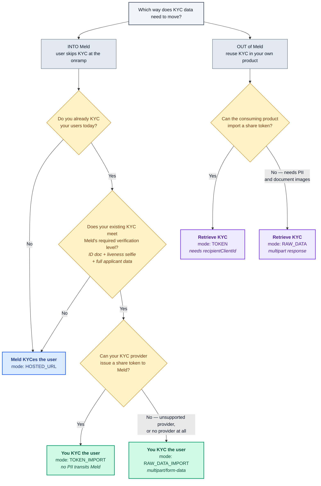

This section is for developers who want to KYC their users once and reuse that verification across multiple onramps. Meld's Unified KYC lets a user complete KYC a single time and then transact through any supported onramp without re-verifying — improving conversion and reducing friction.

There are 3 flows within Unified KYC:

1. [**Meld KYCes the user:**](/docs/stablecoins/unified-kyc/meld-kyces-the-user) You call Meld's API to get back a KYC link and launch it from your UI; Meld handles the rest. **This is the best flow from a user experience standpoint**, as Meld will ensure it collects all KYC data required by the downstream onramps.
2. [**You KYC the user:**](/docs/stablecoins/unified-kyc/you-kyc-the-user) You integrate a KYC provider yourself, run the user through their KYC process, track status, then pass the KYC token or the raw KYC data to Meld. Since this flow is more work for you, and you would need to ensure that you collect all of the KYC data that the onramps require, this flow is only recommended if you're already KYCing users with a KYC provider.
3. [**Retrieve KYC Data:**](/docs/stablecoins/unified-kyc/retrieve-kyc) If you have a use case where you need the KYC data of your existing users, such as to KYC them for a separate product you are offering, you can fetch a KYC token or the raw KYC data of the user from Meld.

## Which flow should I use?

